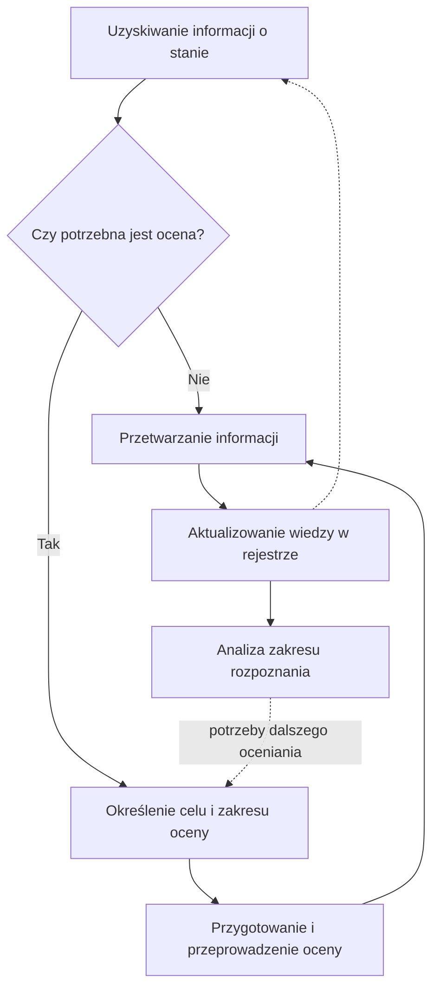

## Cel dokumentu

Dokument przedstawia przykładową procedurę obserwowania i oceniania stanu dostępności i zgodności rozwiązań cyfrowych.

Procedura łączy obserwowanie stanu, oceny planowe i doraźne, przetwarzanie uzyskanych informacji, aktualizowanie rejestru stanu dostępności i zgodności oraz analizowanie potrzeb dalszego oceniania.

## 1. Zastosowanie procedury

Procedurę stosuje się do organizowania obserwowania i oceniania stanu dostępności i zgodności rozwiązania cyfrowego w całym okresie jego użytkowania.

Jej celem jest utrzymywanie aktualnej i udokumentowanej wiedzy o stanie rozwiązania przez:

- wykorzystywanie informacji uzyskiwanych w bieżącej działalności organizacji;
- prowadzenie ocen planowych służących systematycznemu rozwijaniu wiedzy;
- prowadzenie ocen doraźnych w odpowiedzi na określone zdarzenia i potrzeby informacyjne;
- przetwarzanie uzyskanych informacji i aktualizowanie wiedzy o stanie;
- analizowanie zakresu rozpoznania i ustalanie potrzeb dalszego oceniania.

Procedurę dostosowuje się do wielkości organizacji, liczby i złożoności rozwiązań cyfrowych oraz sposobu organizacji systemu zapewniania dostępności cyfrowej.

Role i odpowiedzialności związane z obserwowaniem i ocenianiem stanu określa zalecenie „Obserwowanie i ocenianie stanu dostępności i zgodności rozwiązań cyfrowych”.

## 2. Ogólny przebieg procesu

Obserwowanie i ocenianie stanu jest procesem ciągłym i iteracyjnym.

Informacje o stanie rozwiązania są uzyskiwane podczas bieżącej działalności organizacji oraz ocen planowych i doraźnych. Uzyskane informacje są przetwarzane i wykorzystywane do aktualizowania wiedzy zgromadzonej w rejestrze stanu dostępności i zgodności.

Wiedza zgromadzona w rejestrze jest analizowana w celu ustalania zakresu rozpoznania stanu i potrzeb dalszego oceniania. Zdarzenia i potrzeby informacyjne mogą niezależnie prowadzić do przeprowadzenia ocen doraźnych.

Proces obejmuje:

1. uzyskiwanie informacji o stanie rozwiązania;
2. ustalanie potrzeby przeprowadzenia oceny;
3. określanie celu i zakresu oceny;
4. przygotowanie i przeprowadzenie oceny;
5. przetwarzanie uzyskanych informacji;
6. aktualizowanie wiedzy o stanie;
7. analizowanie zakresu rozpoznania i ustalanie potrzeb dalszego oceniania.

Poszczególne działania są podejmowane odpowiednio do źródła informacji, dotychczasowej wiedzy oraz potrzeb dalszego oceniania i nie muszą być każdorazowo wykonywane jako jeden ciąg.

## 3. Uzyskiwanie informacji o stanie

Informacje o stanie dostępności i zgodności są uzyskiwane podczas ocen planowych i doraźnych, z dokumentacji i materiałów dowodowych otrzymywanych od wykonawców i dostawców rozwiązań cyfrowych oraz w bieżącej działalności organizacji, między innymi ze zgłoszeń i skarg użytkowników, monitorowania, odbiorów i przeglądów rozwiązań, zmian rozwiązania, działań naprawczych i badań z użytkownikami.

Uzyskana informacja może zostać bezpośrednio przetworzona albo wskazywać potrzebę przeprowadzenia oceny.

## 4. Ustalanie potrzeby przeprowadzenia oceny

Potrzeba przeprowadzenia oceny może wynikać z planowego rozwijania wiedzy o stanie albo z określonego zdarzenia lub potrzeby informacyjnej.

W zależności od przyczyny przeprowadza się ocenę planową albo doraźną.

### 4.1. Ocena planowa

Ocenę planową przeprowadza się w celu systematycznego zwiększania lub aktualizowania zakresu wiedzy o stanie rozwiązania.

Potrzebę i zakres kolejnej oceny planowej ustala się na podstawie aktualnej wiedzy o stanie oraz wyników analizy zakresu rozpoznania.

### 4.2. Ocena doraźna

Ocenę doraźną przeprowadza się w odpowiedzi na określone zdarzenie albo potrzebę uzyskania informacji.

Przyczyną oceny doraźnej może być w szczególności:

- zgłoszenie lub skarga użytkownika;
- zmiana rozwiązania;
- ujawnienie problemu dostępności;
- potrzeba sprawdzenia skuteczności działania naprawczego;
- odbiór rozwiązania albo jego części;
- potrzeba zweryfikowania wcześniejszego ustalenia;
- uzyskanie informacji wskazującej możliwość występowania problemu.

Zakres oceny doraźnej określa się odpowiednio do zdarzenia lub potrzeby, która spowodowała jej przeprowadzenie.

## 5. Określanie celu i zakresu oceny

Przed przeprowadzeniem oceny określa się jej cel oraz zakres potrzebny do uzyskania informacji odpowiadających temu celowi.

Zakres oceny określa się w trzech wymiarach:

- zakres wymagań;
- zakres funkcjonalny;
- zakres badanej próby.

W przypadku oceny planowej określa się również profil oceny.

Przy ustalaniu celu i zakresu wykorzystuje się aktualną wiedzę zgromadzoną w rejestrze stanu dostępności i zgodności oraz, w przypadku ocen planowych, wyniki analizy zakresu rozpoznania.

Szczegółowe zasady określania zakresu i profilu ocen przedstawia załącznik „Profile i zakres ocen stanu dostępności i zgodności”.

## 6. Przygotowanie i przeprowadzenie oceny

Na podstawie ustalonego celu i zakresu oceny:

- wybiera się scenariusze testów i inne metody uzyskania informacji;
- wskazuje się obiekty tworzące badaną próbę;
- ustala się sposób przeprowadzenia oceny i dokumentowania jej wyników;
- zapewnia się potrzebne kompetencje, narzędzia i środowiska testowe.

Ocenę przeprowadza się zgodnie z ustalonym celem i zakresem, dokumentując uzyskane wyniki i materiały dowodowe.

Jeżeli podczas oceny uzyskane zostaną informacje uzasadniające zmianę jej zakresu, zakres może zostać odpowiednio zmodyfikowany. Zmianę dokumentuje się w sposób umożliwiający prawidłową interpretację wyników oceny.

## 7. Przetwarzanie wyników

Informacje uzyskane podczas obserwowania i oceniania przetwarza się w celu ustalenia ich znaczenia dla wiedzy o stanie rozwiązania oraz odniesienia nowych informacji do wcześniejszych ustaleń.

Szczegółowe zasady określa załącznik „Przetwarzanie wyników obserwowania i oceniania stanu dostępności i zgodności”.

## 8. Aktualizowanie wiedzy o stanie

Wyniki obserwowania i oceniania wykorzystuje się do aktualizowania rejestru stanu dostępności i zgodności w sposób umożliwiający ustalenie, co na podstawie dostępnych informacji wiadomo obecnie o stanie rozwiązania.

Szczegółowe zasady określa załącznik „Zasady prowadzenia rejestru stanu dostępności i zgodności”.

## 9. Analizowanie zakresu rozpoznania i ustalanie potrzeb dalszego oceniania

Wiedzę zgromadzoną w rejestrze analizuje się w celu ustalenia zakresu rozpoznania stanu, luk w wiedzy oraz potrzeb dalszego oceniania. Wyniki analizy wykorzystuje się podczas planowania kolejnych ocen.

Szczegółowe zasady określa załącznik „Analiza zakresu rozpoznania stanu dostępności i zgodności”.

## 10. Schemat procesu

