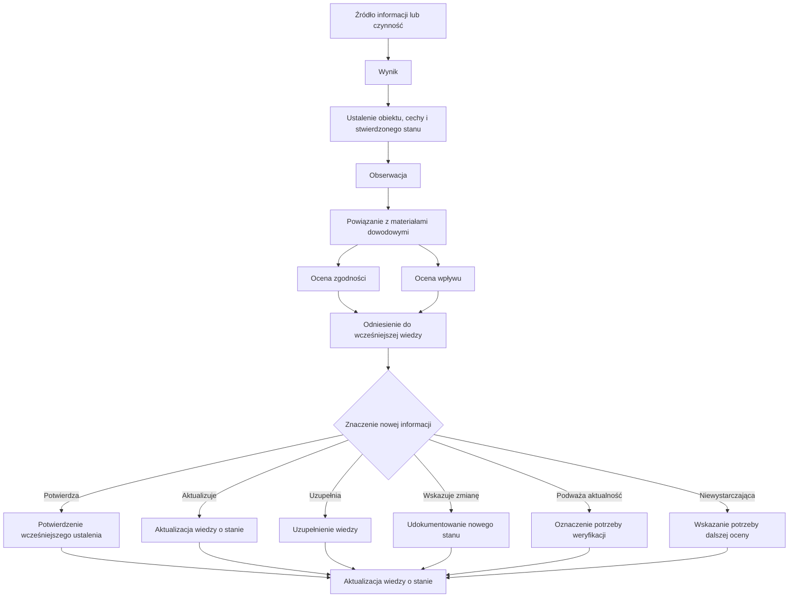

## Cel dokumentu

Dokument określa zasady przekształcania informacji uzyskanych podczas obserwowania i oceniania w udokumentowaną wiedzę o stanie dostępności i zgodności rozwiązania cyfrowego.

Wyjaśnia różnicę między czynnością służącą uzyskaniu informacji, jej wynikiem, obserwacją i oceną oraz określa zasady odnoszenia nowych informacji do dotychczasowej wiedzy.

## 1. Od informacji do wiedzy o stanie

Informacje o stanie dostępności i zgodności rozwiązania cyfrowego mogą pochodzić z różnych źródeł i być uzyskiwane za pomocą różnych metod.

Samo wykonanie testu, uzyskanie wyniku narzędzia automatycznego, otrzymanie zgłoszenia użytkownika albo przeprowadzenie audytu nie prowadzi automatycznie do powstania uporządkowanej wiedzy o stanie rozwiązania.

Uzyskane informacje wymagają przetworzenia polegającego na:

1. ustaleniu, czego dotyczy informacja i jaki stan został stwierdzony;
2. wyodrębnieniu obserwacji;
3. powiązaniu obserwacji z materiałami dowodowymi;
4. dokonaniu odpowiednich ocen;
5. odniesieniu nowych informacji do dotychczasowej wiedzy;
6. ustaleniu wynikającej z nich zmiany wiedzy o stanie.

Przetwarzanie wyników powinno zachować możliwość ustalenia związku między źródłem informacji, stwierdzonym stanem, podstawą dokonanego ustalenia, oceną oraz wynikającą z nowych informacji zmianą wiedzy.

## 2. Czynność, wynik, obserwacja i ocena

Podczas przetwarzania informacji należy rozróżniać:

- **czynność służącą uzyskaniu informacji**;
- **wynik czynności**;
- **obserwację**;
- **ocenę**.

### 2.1. Czynność służąca uzyskaniu informacji

Czynnością służącą uzyskaniu informacji może być w szczególności:

- wykonanie scenariusza testu;
- zastosowanie narzędzia automatycznego;
- przeprowadzenie oceny eksperckiej;
- przeprowadzenie badania z użytkownikiem;
- analiza zgłoszenia lub skargi;
- analiza dokumentacji;
- zastosowanie innej metody pozwalającej uzyskać informacje o stanie.

Czynność jest sposobem uzyskania informacji. Nie jest obserwacją ani oceną stanu.

### 2.2. Wynik czynności

Wynik dokumentuje przebieg lub rezultat czynności służącej uzyskaniu informacji.

Może nim być w szczególności:

- wynik wykonania scenariusza testu;
- raport narzędzia automatycznego;
- wynik badania z użytkownikiem;
- ustalenie audytu;
- wynik analizy zgłoszenia;
- wynik weryfikacji działania naprawczego.

Jedna czynność może nie dostarczyć informacji wymagającej udokumentowania jako nowa obserwacja, potwierdzić wcześniejsze ustalenia albo dostarczyć podstawy do udokumentowania jednej lub wielu obserwacji.

### 2.3. Obserwacja

Obserwacja jest udokumentowaną informacją o stwierdzonym stanie cechy określonego obiektu.

Powinna umożliwiać ustalenie:

- jakiego obiektu dotyczy;
- jaka cecha została zaobserwowana;
- jaki stan cechy stwierdzono;
- kiedy dokonano obserwacji;
- z jakiego źródła pochodzi informacja;
- na jakiej podstawie dokonano ustalenia.

Obserwacja opisuje stwierdzony stan, a nie sposób przeprowadzenia badania ani jego ogólny wynik.

Przykład:

> **Wynik testu:** test etykiet pól formularza — wynik negatywny.
>
> **Obserwacja:** pole „Adres poczty elektronicznej” w formularzu rejestracji nie ma programowo określonej etykiety.

Pierwszy zapis opisuje wynik czynności. Drugi wskazuje obiekt, cechę i stwierdzony stan, dlatego może stanowić podstawę dalszych ocen i aktualizowania wiedzy.

### 2.4. Ocena

Ocena określa znaczenie stwierdzonego stanu z określonego punktu widzenia.

Ta sama obserwacja może stanowić podstawę różnych ocen.

Przykład:

> **Obserwacja:** pole „Adres poczty elektronicznej” nie ma programowo określonej etykiety.
>
> **Ocena zgodności:** niespełnione mające zastosowanie wymaganie dostępności.
>
> **Ocena wpływu:** przeszkoda dla użytkowników czytników ekranu.

Obserwacja i jej oceny są odrębnymi, powiązanymi informacjami.

## 3. Wyodrębnianie obserwacji

Informacje uzyskane podczas obserwowania i oceniania analizuje się w celu ustalenia:

- przedmiotu obserwacji;
- zaobserwowanej cechy;
- stwierdzonego stanu;
- czasu dokonania obserwacji;
- źródła informacji;
- podstawy dokonanego ustalenia.

Obserwacja powinna opisywać stan na tyle precyzyjnie, aby można było ją zrozumieć i wykorzystać niezależnie od opisu czynności, podczas której stan został stwierdzony.

Nie należy sprowadzać obserwacji do ogólnego wyniku testu, nazwy niespełnionego wymagania ani informacji o występowaniu błędu.

Przedmiot obserwacji powinien być określony odpowiednio do charakteru stwierdzonego stanu. Może nim być pojedynczy element, komponent, dokument, strona, ekran, proces użytkownika, obszar funkcjonalny albo jednoznacznie określona grupa obiektów.

## 4. Jedna czynność a wiele obserwacji

Jedna czynność służąca uzyskaniu informacji może prowadzić do udokumentowania wielu obserwacji.

Jeżeli stwierdzone informacje dotyczą różnych obiektów, cech albo stanów, powinny być rozpatrywane odrębnie.

Przykładowo ocena formularza może wykazać:

- brak programowo określonej etykiety pola;
- nieprawidłową kolejność fokusu;
- brak identyfikacji błędu;
- brak programowego powiązania komunikatu o błędzie z polem.

Każdy z tych stanów może wymagać odrębnej obserwacji, nawet jeżeli został stwierdzony podczas wykonywania jednego scenariusza testu.

Rozdzielenie obserwacji powinno umożliwiać ich niezależne ocenianie, aktualizowanie oraz wykorzystywanie jako podstawy decyzji i działań.

## 5. Stan występujący w wielu obiektach

Ten sam stan może występować w wielu miejscach rozwiązania.

W zależności od charakteru i przyczyny stwierdzonego stanu można:

- udokumentować odrębne obserwacje dotyczące poszczególnych obiektów;
- udokumentować obserwację dotyczącą jednoznacznie określonej grupy obiektów;
- udokumentować wspólny stan wynikający z zastosowania tego samego komponentu, szablonu, mechanizmu albo sposobu tworzenia treści.

Sposób wyodrębnienia obserwacji powinien umożliwiać ustalenie rzeczywistego zakresu występowania stanu oraz jego późniejsze aktualizowanie.

Nie należy tworzyć wielu identycznych obserwacji, jeżeli nie zwiększa to wiedzy o stanie ani możliwości jej wykorzystania.

Nie należy również łączyć w jednej obserwacji odrębnych stanów, jeżeli utrudnia to ich ocenianie, aktualizowanie lub powiązanie z decyzjami i działaniami.

## 6. Materiały dowodowe

Każda obserwacja powinna mieć możliwą do wskazania podstawę dowodową.

Materiał dowodowy powinien umożliwiać potwierdzenie stwierdzonego stanu albo sposobu dokonania ustalenia.

Materiałem dowodowym może być w szczególności:

- wynik lub zapis wykonania testu;
- zrzut ekranu;
- nagranie;
- fragment kodu;
- raport;
- protokół;
- wynik narzędzia automatycznego;
- dokumentacja techniczna;
- zgłoszenie lub skarga użytkownika;
- wynik badania z użytkownikami;
- korespondencja z wykonawcą.

Jedna obserwacja może być powiązana z wieloma materiałami dowodowymi, a jeden materiał dowodowy może stanowić podstawę wielu obserwacji.

Rodzaj i zakres materiałów dowodowych powinien być odpowiedni do charakteru obserwacji oraz sposobu wykorzystania wynikającej z niej wiedzy.

## 7. Ocena zgodności

Ocena zgodności określa relację stwierdzonego stanu do mającego zastosowanie wymagania dostępności.

Przed dokonaniem oceny należy ustalić:

- jakie wymaganie ma zastosowanie;
- jakiego obiektu albo zakresu dotyczy ocena;
- czy posiadane informacje i materiały dowodowe są wystarczające do dokonania oceny.

Wynik oceny zgodności może wskazywać:

- spełnione;
- niespełnione;
- nie dotyczy;
- brak wystarczających danych do dokonania oceny.

Wynik odnosi się do wymagania oraz zakresu, dla którego uzyskano wystarczające informacje.

Nie należy automatycznie uogólniać wyniku poza oceniony zakres.

Jedna obserwacja może stanowić podstawę oceny zgodności z więcej niż jednym wymaganiem. Jedno wymaganie może być oceniane na podstawie wielu obserwacji.

## 8. Ocena wpływu na użytkowników

Ocena wpływu określa znaczenie stwierdzonego stanu dla możliwości korzystania z rozwiązania.

Przy ocenie wpływu można uwzględniać w szczególności:

- strategie korzystania z rozwiązania;
- użytkowników, których może dotyczyć stwierdzony stan;
- znaczenie funkcji lub procesu;
- częstotliwość występowania problemu;
- możliwość wykonania zadania;
- możliwość zastosowania sposobu obejścia problemu.

Wynik oceny wpływu dokumentuje się według przyjętej w SZDC skali:

- brak istotnego wpływu;
- kłopot;
- przeszkoda;
- bariera.

Ocena wpływu jest odrębna od oceny zgodności.

Niezgodności z tym samym wymaganiem mogą mieć różny wpływ zależnie od miejsca, funkcji i kontekstu ich występowania. Stan zgodny z obowiązkowymi wymaganiami może natomiast ujawniać problem istotny dla użytkowników i wymagający uwagi organizacji.

## 9. Odnoszenie nowych informacji do dotychczasowej wiedzy

Nowe informacje należy odnosić do wiedzy uzyskanej wcześniej.

Organizacja ustala, czy nowa informacja:

- potwierdza wcześniejsze ustalenie;
- aktualizuje wiedzę o stanie;
- uzupełnia brakujące informacje;
- podważa aktualność wcześniejszego ustalenia;
- wskazuje zmianę stanu;
- wskazuje potrzebę dodatkowej lub ponownej oceny.

Odnoszenie nowych informacji do wcześniejszej wiedzy zapobiega tworzeniu kolejnych niezależnych zbiorów wyników i umożliwia utrzymywanie rozwijanego obrazu stanu rozwiązania.

## 10. Dokumentowanie nowego stanu i zmiany stanu

Nową obserwację dokumentuje się, jeżeli:

- stwierdzono wcześniej nieudokumentowany stan;
- nowa informacja dotyczy innego obiektu lub cechy;
- ponowna ocena wykazała zmianę stanu;
- zachowanie odrębnego zapisu jest potrzebne do odtworzenia historii zmian.

Jeżeli nowa informacja wskazuje zmianę wcześniej udokumentowanego stanu:

1. dokumentuje się nową obserwację;
2. wiąże się ją z wcześniejszym ustaleniem;
3. wskazuje się podstawę stwierdzenia nowego stanu;
4. dokonuje się potrzebnych ocen;
5. aktualizuje się wiedzę o obecnym stanie.

Wcześniejszej obserwacji nie nadpisuje się nowym stanem. Pozostaje ona historycznym zapisem ustalenia dokonanego w określonym czasie.

## 11. Potwierdzanie wcześniejszego stanu

Ponowne wykonanie testu albo zastosowanie innej metody może potwierdzić stan udokumentowany wcześniej.

W takim przypadku należy zachować możliwość ustalenia:

- co zostało ponownie ocenione;
- za pomocą jakiej metody;
- na jakiej podstawie potwierdzono wcześniejsze ustalenie;
- kiedy dokonano potwierdzenia.

Samo potwierdzenie wcześniejszego stanu nie wymaga tworzenia kolejnej identycznej obserwacji, jeżeli wynik ponownej oceny i jego podstawa mogą zostać jednoznacznie powiązane z wcześniejszym ustaleniem.

Nową obserwację należy udokumentować, jeżeli jest to potrzebne do zachowania historii zmian albo prawidłowego przedstawienia zakresu przeprowadzonej oceny.

## 12. Informacje niewystarczające do dokonania oceny

Nie każda uzyskana informacja umożliwia jednoznaczne ustalenie stanu albo dokonanie oceny.

Informacja może w szczególności:

- wskazywać możliwość występowania problemu;
- być niepełna;
- pochodzić ze źródła wymagającego weryfikacji;
- nie pozwalać na jednoznaczne ustalenie stanu;
- nie dostarczać wystarczającej podstawy do oceny zgodności lub wpływu.

W takim przypadku informację należy zachować odpowiednio do jej znaczenia oraz wskazać potrzebę jej weryfikacji lub przeprowadzenia dalszej oceny.

Brak wystarczających danych nie stanowi podstawy do uznania wymagania za spełnione.

Informacja, której nie można jeszcze przekształcić w jednoznaczną obserwację lub ocenę, nie powinna być odrzucana, jeżeli może mieć znaczenie dla wiedzy o stanie rozwiązania.

## 13. Aktualizowanie wiedzy o stanie

Po przetworzeniu nowych informacji należy ustalić, w jaki sposób wpływają one na dotychczasową wiedzę o stanie rozwiązania.

W zależności od uzyskanych wyników może być potrzebne:

- udokumentowanie nowej obserwacji;
- powiązanie nowej informacji z wcześniejszym ustaleniem;
- udokumentowanie oceny zgodności lub wpływu;
- powiązanie obserwacji i ocen z materiałami dowodowymi;
- potwierdzenie aktualności wcześniejszej wiedzy;
- wskazanie, że wcześniejsze ustalenie wymaga weryfikacji;
- wskazanie utraty aktualności wcześniejszego ustalenia;
- zaktualizowanie wiedzy o obecnym stanie;
- wskazanie potrzeby dalszej oceny.

Przetworzenie wyników kończy się ustaleniem, co na podstawie uzyskanych informacji można obecnie wiarygodnie powiedzieć o stanie dostępności i zgodności rozwiązania.

Szczegółowe zasady organizowania, aktualizowania i utrzymywania wiedzy określa załącznik „Zasady prowadzenia rejestru stanu dostępności i zgodności”.

## 14. Schemat przetwarzania wyników

