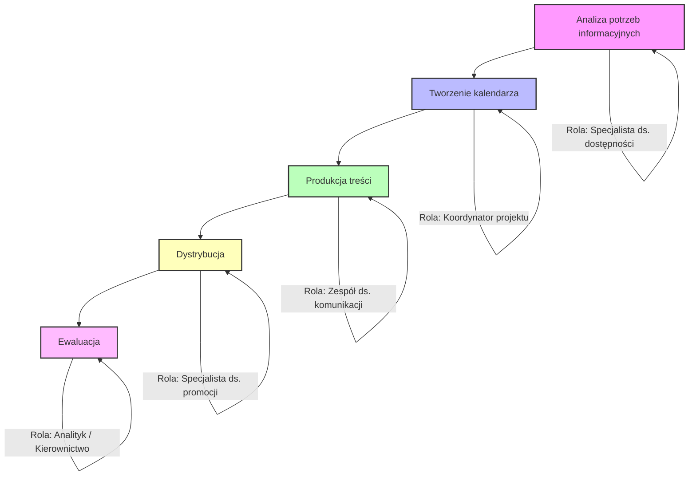

## Zalecenie: Stworzenie kalendarza publikacji dotyczących dostępności cyfrowej

## Cel zalecenia
Zapewnienie systematycznej i skutecznej komunikacji w zakresie dostępności cyfrowej poprzez opracowanie kalendarza publikacji oraz wdrożenie procesu jego realizacji.

## Zakres zalecenia
- Opracowanie rocznego kalendarza publikacji.
- Określenie tematów publikacji w logicznej kolejności.
- Wybór narzędzi komunikacji do dystrybucji treści, w zależności od grupy docelowej.
- Monitorowanie realizacji planu.

## Proces realizacji

1. **Analiza potrzeb informacyjnych** – identyfikacja kluczowych obszarów dostępności cyfrowej.
2. **Tworzenie kalendarza** – ustalenie harmonogramu publikacji (np. miesięcznego lub kwartalnego).
3. **Produkcja treści** – przygotowanie materiałów zgodnych z zasadami dostępności.
4. **Dystrybucja** – publikacja w wybranych kanałach komunikacji.
5. **Ewaluacja** – ocena skuteczności i aktualizacja kalendarza.

## Przykładowy harmonogram publikacji - tematy publikacji
1. **Styczeń** – Wprowadzenie do dostępności cyfrowej: podstawowe pojęcia i znaczenie.
2. **Luty** – Standardy WCAG i ich zastosowanie w praktyce.
3. **Marzec** – Dostępne dokumenty: jak tworzyć pliki PDF, DOCX i XLSX zgodne z zasadami dostępności.
4. **Kwiecień** – Dostępność stron internetowych: audyt i narzędzia.
5. **Maj** – Dostępność multimediów: napisy, audiodeskrypcja, tłumaczenia.
6. **Czerwiec** – Technologie wspomagające: czytniki ekranu i inne narzędzia.
7. **Lipiec** – Międzynarodowy Miesiąc Dumy z Niepełnosprawności: jak instytucje mogą wspierać inkluzywność i różnorodność.
8. **Sierpień** – Szkolenia i zasoby edukacyjne dla pracowników instytucji.
9. **Wrzesień** – Dostępność w mediach społecznościowych.
10. **Październik** – Najczęstsze błędy w dostępności i jak ich unikać.
11. **Listopad** – Monitorowanie i raportowanie dostępności.
12. **Grudzień** – Podsumowanie roku i plany na kolejny rok.

## Przykładowe narzędzia komunikacji (dopasowane do grupy docelowej)

### Komunikacja wewnętrzna (do pracowników)
- Spotkania zespołów – zakomunikowanie stworzenia takiego harmonogramu, omówienie realizacji i priorytetów.
- Szkolenia oraz konsultacje ze specjalistą ds. dostępności dla zespołu
- Intranet instytucji – komunikaty i materiały edukacyjne.
- Newsletter wewnętrzny – informacje o postępach i szkoleniach.
 
### Komunikacja zewnętrzna (do odbiorców)
- **Strona internetowa instytucji** – publikacja artykułów i poradników.
- **Newsletter** – regularne wysyłki do subskrybentów.
- **Media społecznościowe** – Facebook, Instagra, TikTok, YouTube, LinkedIn i in.
- **Webinary i szkolenia online** – interaktywne sesje edukacyjne.
- **Materiały drukowane** – broszury i plakaty w budynkach instytucji.

## Monitorowanie realizacji - przykładowe działania lub wskaźniki pomiarowe

### Analiza podjętych działań
- Ustalenie wskaźników (np. liczba publikacji, zasięg odbiorców).
- Feedback od pracowników (ankiety, spotkania).
- Comiesięczne raporty z realizacji zadania (wyrażone w przyjętych wskaźnikach) na potrzeby komórki organizacyjnej.
- Aktualizacja kalendarza na podstawie wyników ewaluacji.

### Raportowanie Rodzaje działań wykonywane w komórce organizacyjnej
- Raporty dla kierownictwa o realizacji harmonogramu.
- Komunikacja z zespołem pracowników nt. osiągniętych efektów i planowanych dalszych działań.

---

## Role i odpowiedzialności
- **Specjalista ds. dostępności / analityk komunikacji** – Analiza potrzeb informacyjnych: identyfikacja kluczowych obszarów dostępności cyfrowej; 
zebranie informacji od interesariuszy (wewnętrznych i zewnętrznych).
- **Koordynator projektu / Kierowniczka Sekcji Dostępności Cyfrowej** – Tworzenie kalendarza publikacji: ustalenie harmonogramu (miesięcznego lub kwartalnego);
określenie kolejności tematów publikacji; zatwierdzenie planu z kierownictwem.
- **Zespół ds. komunikacji / copywriterzy / graficy** – Produkcja treści: przygotowanie materiałów zgodnych z zasadami dostępności (WCAG); tworzenie artykułów,
poradników, materiałów multimedialnych; weryfikacja jakości i zgodności z wytycznymi.
- **Specjalista ds. promocji online / social media manager** – Dystrybucja treści: publikacja w kanałach zewnętrznych (strona www, media społecznościowe, 
newsletter); komunikacja wewnętrzna (intranet, newsletter wewnętrzny); organizacja webinarów i szkoleń.
- **Analityk/Kierownictwo** – Monitorowanie i ewaluacja: raportowanie realizacji harmonogramu; analiza wskaźników (liczba publikacji, zasięg odbiorców); 
aktualizacja kalendarza na podstawie wyników.

---

## Rekomendowane dobre praktyki
- Stworzenie i implementacja w organizacji Polityki dostępności cyfrowej, której ww. harmonogram jest elementem

---

