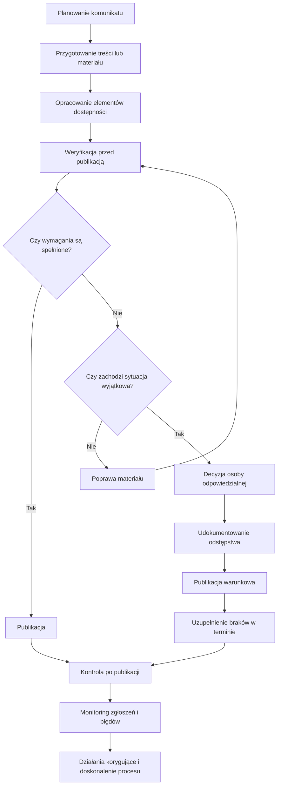

## Cel

Model określa jednolity przebieg procesu przygotowania, weryfikacji i publikacji materiałów dostępnych.

## Zakres

Model obejmuje publikację materiałów w:
- systemie zarządzania treścią (CMS),
- Biuletynie Informacji Publicznych (BIP),
- serwisie internetowym,
- mediach społecznościowych,
- platformie zewnętrznej.

Obejmuje materiały wideo, audio, grafiki i treści tekstowe.

## Materiały zewnętrzne

Model stosuje się również do materiałów zewnętrznych, w tym:
- materiału od wykonawcy,
- materiału od partnera,
- nagrania transmisji,
- materiału osadzanego z platformy zewnętrznej.

Wymagania dostępności dla materiałów zewnętrznych należy określać już na etapie:
- zamówienia,
- zlecenia,
- briefu,
- umowy,
- odbioru materiału.

## Role i odpowiedzialność

- **Autor/redaktor:** przygotowanie treści i struktury komunikatu.
- **Osoba opracowująca dostępność:** napisy, transkrypcje, opisy alternatywne, treści równoważne.
- **Osoba weryfikująca:** kontrola wymagań przed publikacją.
- **Osoba publikująca:** publikacja techniczna i kontrola po publikacji.
- **Nadzór procesowy:** monitoring błędów i doskonalenie procesu.

## Schemat procesu

## Zasady decyzyjne

Materiał publikuje się po pozytywnej weryfikacji.

Jeżeli wymagania nie są spełnione, materiał wraca do poprawy albo przechodzi ścieżkę procedury wyjątkowej zgodnie z [Procedurą postępowania w sytuacjach wyjątkowych](./procedura-sytuacji-wyjatkowych.md).

## Powiązane dokumenty

- [Minimalne wymagania dostępności](./minimalne-wymagania.md)
- [Mapa odpowiedzialności w procesie publikacji](./mapa-odpowiedzialnosci.md)
- [Listy kontrolne publikacji](./listy-kontrolne-index.md)
- [05. Standard tworzenia dostępnych materiałów audio](./05-standard-tworzenia-dostepnych-materialow-audio.md)
- [Procedura postępowania w sytuacjach wyjątkowych](./procedura-sytuacji-wyjatkowych.md)
