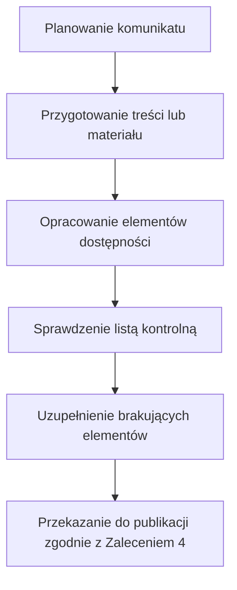

## Cel

Model pokazuje, jak włączyć wymagania dostępności w przygotowanie materiałów multimedialnych i treści cyfrowych.

## Zakres

Model obejmuje publikację materiałów w:
- systemie zarządzania treścią (CMS),
- Biuletynie Informacji Publicznych (BIP),
- serwisie internetowym,
- mediach społecznościowych,
- platformie zewnętrznej.

Obejmuje materiały wideo, audio, grafiki i treści tekstowe.

## Materiały zewnętrzne

Model stosuje się również do materiałów zewnętrznych, w tym:
- materiału od wykonawcy,
- materiału od partnera,
- nagrania transmisji,
- materiału osadzanego z platformy zewnętrznej.

Wymagania dostępności dla materiałów zewnętrznych należy określać już na etapie:
- zamówienia,
- zlecenia,
- briefu,
- umowy,
- odbioru materiału.

## Role wspierające przygotowanie materiału

- **Autor/redaktor:** przygotowanie treści i struktury komunikatu.
- **Osoba opracowująca dostępność:** napisy, transkrypcje, opisy alternatywne, treści równoważne.
- **Osoba sprawdzająca materiał:** porównanie materiału z wymaganiami, standardem albo listą kontrolną.
- **Osoba publikująca:** techniczne udostępnienie materiału w wybranym kanale.
- **Koordynacja dostępności:** wsparcie zespołów i aktualizacja standardów.

## Schemat pracy z materiałem

## Relacja do Zalecenia 4

Model nie określa decyzji publikacyjnej ani sposobu dokumentowania kontroli. Weryfikacja spełnienia wymagań dostępności przed publikacją odbywa się zgodnie z procedurą określoną w Zaleceniu 4.

## Powiązane dokumenty

- [Minimalne wymagania dostępności](./minimalne-wymagania.md)
- [Listy kontrolne publikacji](./listy-kontrolne-index.md)
- [05. Standard tworzenia dostępnych materiałów audio](./05-standard-tworzenia-dostepnych-materialow-audio.md)
