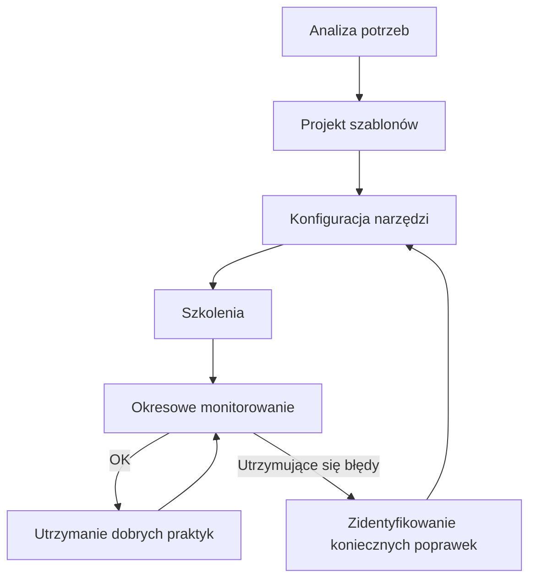

## Nazwa dobrej praktyki
Wprowadzenie domyślnych ustawień dostępności dla aplikacji cyfrowych w organizacji wykorzystywanych do komunikacji

## Wymiar dostępności:
Komunikacja

## Podmiot realizujący dobrą praktykę
Instytucja publiczna (np. urząd centralny, muzeum, biblioteka)

## Powód realizacji dobrej praktyki
Jedną z przeszkód w skutecznym wprowadzaniu dostepności cyfrowej w instytucji publicznej jest wielość obowiązków pracowników. Konieczność dbania o dostępność cyfrową zwiększa tę listę. Przygotowanie szablonów wykorzystywanych dokumentów oraz skonfigurowania ustawień aplikacji z pakietu MS Office (aplikacji biurowych) i innych wykorzystywanych do komunikacji tak, żeby od razu miały odpowiednie cechy zmniejsza ilość zadań, które trzeba wypełniać. To sprzyja wprowadzaniu dostępności cyfrowej w organizacji.

---

## Charakterystyka dobrej praktyki

### Zakres dobrej praktyki
- Ujednolicenie szablonów dokumentów (.dotm, .docx, .pptx, szablony umów, szablony prezentacji firmowych itp.) z domyślnymi ustawieniami dostępności.
- Konfiguracja narzędzi do publikacji treści (CMS, intranet) zgodnie z WCAG 2.1 AA.
- Wprowadzenie standardów dla spotkań online (Teams, Zoom) – np. napisy na żywo, kontrast interfejsu.
- Szkolenia dla pracowników w zakresie korzystania z ustawień dostępności.

### Cel dobrej praktyki
Zapewnienie spójnych, dostępnych i zgodnych z prawem ustawień dla narzędzi cyfrowych wykorzystywanych w komunikacji organizacyjnej – zarówno w procesie tworzenia dokumentów (np. szablony Word, PowerPoint), publikacji treści, jak i prowadzenia spotkań online (np. Microsoft Teams). Wprowadzenie domyślnych ustawień dostępności:
- **Zapewnia zgodność z prawem** i minimalizuje ryzyko sankcji.
- **Zwiększa inkluzywność** – umożliwia korzystanie z narzędzi osobom z niepełnosprawnościami.
- **Poprawia jakość komunikacji** i efektywność pracy zespołów.
- **Buduje wizerunek organizacji** jako odpowiedzialnej społecznie.

### Grupa docelowa
Wszyscy pracownicy organizacji.

---

## Opis przeprowadzonych działań

1. **Analiza potrzeb organizacji**
- Przeprowadzono audyt wykorzystywanych narzędzi komunikacyjnych (MS Office, CMS, Microsoft Teams, Zoom itp.).
- Zidentyfikowano najczęstsze bariery dostępności w dokumentach, publikacjach i spotkaniach online.
2. **Opracowanie standardów dostępności**
- Przygotowano listę wymagań zgodnych z WCAG 2.1 AA oraz ustawą o dostępności cyfrowej oraz dobrymi praktykami.
- Określono minimalne parametry (np. kontrast, struktura nagłówków, opisy alternatywne).
3. **Konfiguracja narzędzi i przygotowanie szablonów**
- Utworzono szablony dokumentów Word i PowerPoint z domyślnymi stylami nagłówków, fontami bezszeryfowymi i instrukcjami dodawania opisów alternatywnych itd.
- Skonfigurowano ustawienia Microsoft Teams (napisy na żywo, opcje tłumaczeń, rozmycie tła, itp.).
- W CMS (strony www, intranet) wdrożono walidację kontrastu, możliwość dodawania opisów ALT i transkrypcji.
4. **Testy i weryfikacja**
- Przeprowadzono testy dostępności szablonów i ustawień w narzędziach (Accessibility Checker, WAVE, manualne).
- Zweryfikowano zgodność z WCAG 2.1 AA i ustawą o dostępności cyfrowej oraz dobrymi praktykami.
5. **Szkolenia i komunikacja wewnętrzna**
- Zorganizowano szkolenia online dla pracowników dotyczące korzystania z nowych ustawień w aplikacjach komunikacyjnych, edytorach tekstu oraz szablonów.
- Udostępniono instrukcje i checklisty w intranecie.
6. **Monitorowanie i doskonalenie**
- Ustalono cykliczne audyty dostępności dokumentów i treści publikowanych w CMS.
- Zbierane są opinie pracowników i użytkowników w celu dalszego usuwania błędów oraz ulepszania ustawień.

## Checklisty ustawień dostępności dla podstawowych edytorów treści i aplikacji do komunikacji
::: do weryfikacji lub uzupełnienia :::

### Word (szablony dokumentów)
- [ ] Ustaw domyślny wygląd nagłówków (H1, H2, H3) oraz innych styli w szablonie .dotm, style niezalecane dla organizacji wyłącz.
- [ ] Ustaw czcionkę bezszeryfową (np. Arial) jako domyślną.
- [ ] W ustawieniach styli zapewnij kontrast kolorów min. 4.5:1 między kolorem tła dokumentu a kolorem fontu.
- [ ] Dodaj instrukcję dodawania opisów alternatywnych do obrazów.
- [ ] Wykorzystaj tak dużo ustawień domyślnych wskazanych wprost w WCAG oraz w dobrych praktykach, jak to możliwe.
- [ ] Włącz automatyczne sprawdzanie dostępności w Word.

### Microsoft Teams (spotkania online)
- [ ] Włącz napisy na żywo w ustawieniach spotkań.
- [ ] Ustaw domyślną opcję nagrywania z napisami.
- [ ] Włącz możliwość tłumaczenia na język migowy (jeśli dostępne).
- [ ] Zapewnij opcję rozmycia tła dla prywatności.
- [ ] Udostępniaj materiały w formatach dostępnych (PDF/UA, DOCX).
- [ ] Przygotuj instrukcje obsługi z wykorzystaniem klawiatury. 

### CMS / Publikacja treści
- [ ] Włącz automatyczne generowanie atrybutów ALT dla obrazów (wymaga manualnej weryfikacji osoby zatwierdzającej publikację).
- [ ] Zapewnij możliwość dodawania tekstowej alternatywy dla publikowanych treści multimedialnych (transkrypcje, napisy rozszerzone, audiodeskrypcje, opisy alternatywne).
- [ ] Ustaw domyślny szablon publikacji zgodny z WCAG 2.1 dla wykorzystywanych edytorów treści.
- [ ] Przygotuj i udostępnij wszystkim pracownikom szablony dokumentów wykorzystywanych w instytucji (np. szablony zamówień, szablony umów itp.) skonfigurowane prawidłowo pod względem dostępności cyfrowej.
- [ ] Włącz walidację kontrastu kolorów w edytorze treści.
- [ ] Zapewnij responsywność i obsługę klawiaturą dla wszystkich elementów.
- [ ] Zadbaj o regularne audytowanie CMS i strony www pod kątem zgodności z WCAG 2.1

---

## Zasoby / koszty
1. **Zasoby ludzkie:** Zespół IT (konfiguracja aplikacji), zespół ds. dostępności, dział komunikacji.
2. **Koszty:**
- Licencje na oprogramowanie (np. Microsoft 365, narzędzia do napisów).
- Szkolenia dla pracowników (webinary, materiały e-learningowe).
- Czas pracy zespołu na przygotowanie szablonów i konfigurację.
- Wsparcie zewnętrzne: Konsultacje z ekspertami ds. dostępności (opcjonalnie).

---

## Opis osiągniętych rezultatów
1. Wszystkie dokumenty tworzone w organizacji spełniają minimalne wymagania dostępności (np. poprawna struktura nagłówków, kontrast).
2. Spotkania online są dostępne dzięki napisom na żywo i materiałom w formatach dostępnych.
3. Publikowane treści w intranecie i na stronie www są zgodne z WCAG 2.1 AA i dobrymi praktykami.
4. Liczba błędów dostępności w dokumentach i publikacjach zmniejszona o min. 70% w ciągu 12 miesięcy.

---

## Sposób pomiaru rezultatów
1. Audyt dostępności dokumentów oraz treści przed i po wdrożeniu (np. narzędzia Microsoft Accessibility Checker, WAVE).
2. Statystyki użycia funkcji dostępności (np. napisy w Teams).
3. Ankieta wśród pracowników – ocena łatwości korzystania z nowych ustawień (przed zmiana i po zmianie).
4. Raport zgodności z WCAG dla CMS i intranetu.

---

## Diagram procesu wdrożenia i doskonalenia

