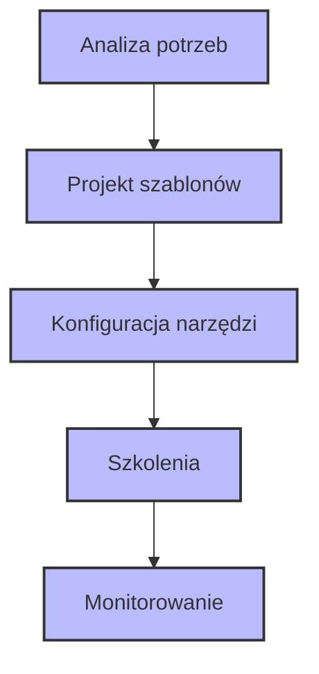

## Cel dobrej praktyki
Zapewnienie spójnych, dostępnych i zgodnych z prawem ustawień dla narzędzi cyfrowych wykorzystywanych w komunikacji organizacyjnej – zarówno w procesie tworzenia dokumentów (np. szablony Word, PowerPoint), publikacji treści, jak i prowadzenia spotkań online (np. Microsoft Teams).

## Zakres dobrej praktyki
- Ujednolicenie szablonów dokumentów (.dotm, .docx, .pptx) z domyślnymi ustawieniami dostępności.
- Konfiguracja narzędzi do publikacji treści (CMS, intranet) zgodnie z WCAG 2.1 AA.
- Wprowadzenie standardów dla spotkań online (Teams, Zoom) – np. napisy na żywo, kontrast interfejsu.
- Szkolenia dla pracowników w zakresie korzystania z ustawień dostępności.

## Rekomendacje dobrych praktyk
1. **Szablony dokumentów**:
   - Używaj stylów nagłówków i list automatycznych.
   - Zapewnij kontrast tekstu min. 4.5:1.
   - Dodawaj opisy alternatywne do grafik.
   - Unikaj obrazów tekstu i ozdobnych fontów.
2. **Publikacja treści**:
   - Stosuj semantyczne znaczniki HTML.
   - Zapewnij responsywność i możliwość powiększania treści.
   - Dodawaj transkrypcje i napisy do materiałów wideo.
3. **Spotkania online (Teams)**:
   - Włącz napisy na żywo i opcję tłumaczenia.
   - Używaj funkcji rozmycia tła dla prywatności.
   - Udostępniaj materiały w formatach dostępnych (PDF/UA, DOCX).
   - Zapewnij możliwość obsługi klawiaturą.

## Podstawy prawne
- **Dyrektywa (UE) 2016/2102** – dostępność stron i aplikacji sektora publicznego.
- **Europejski Akt o Dostępności (EAA)** – obowiązki dla sektora prywatnego od 2025.
- **Ustawa z dnia 4 kwietnia 2019 r. o dostępności cyfrowej**.
- **WCAG 2.1 AA** – standard techniczny dla treści cyfrowych.
- **RODO** – ochrona danych w komunikatorach.

## Uzasadnienie
Wprowadzenie domyślnych ustawień dostępności:
- **Zapewnia zgodność z prawem** i minimalizuje ryzyko sankcji.
- **Zwiększa inkluzywność** – umożliwia korzystanie z narzędzi osobom z niepełnosprawnościami.
- **Poprawia jakość komunikacji** i efektywność pracy zespołów.
- **Buduje wizerunek organizacji** jako odpowiedzialnej społecznie.

## Źródła opracowania
- WCAG 2.1 – Portal Gov.pl
- Ustawa o dostępności cyfrowej
- Europejski Akt o Dostępności
- Microsoft Teams – dokumentacja i dobre praktyki
- Wytyczne tworzenia dokumentów dostępnych cyfrowo

## Diagram procesu wdrożenia

```mermaid
flowchart TD
    A[Analiza potrzeb] --> B[Projekt szablonów]
    B --> C[Konfiguracja narzędzi]
    C --> D[Szkolenia]
    D --> E[Monitorowanie]

    classDef step fill:#bbf,stroke:#333,stroke-width:2px;
    class A,B,C,D,E step;
```

## Checklist ustawień dostępności

### Word (szablony dokumentów)
- Ustaw domyślny styl nagłówków (H1, H2, H3) w szablonie .dotm.
- Włącz automatyczne sprawdzanie dostępności w Word.
- Zapewnij kontrast kolorów min. 4.5:1 w stylach.
- Dodaj instrukcję dodawania opisów alternatywnych do obrazów.
- Ustaw czcionkę bezszeryfową (np. Arial) jako domyślną.

### Microsoft Teams (spotkania online)
- Włącz napisy na żywo w ustawieniach spotkań.
- Ustaw domyślną opcję nagrywania z napisami.
- Włącz możliwość tłumaczenia na język migowy (jeśli dostępne).
- Zapewnij opcję rozmycia tła dla prywatności.
- Udostępniaj materiały w formatach dostępnych (PDF/UA, DOCX).

### CMS / Publikacja treści
- Włącz automatyczne generowanie atrybutów ALT dla obrazów.
- Zapewnij możliwość dodawania opisów multimediów (transkrypcje, napisy).
- Ustaw domyślny szablon publikacji zgodny z WCAG 2.1.
- Włącz walidację kontrastu kolorów w edytorze treści.
- Zapewnij responsywność i obsługę klawiaturą dla wszystkich elementów.
