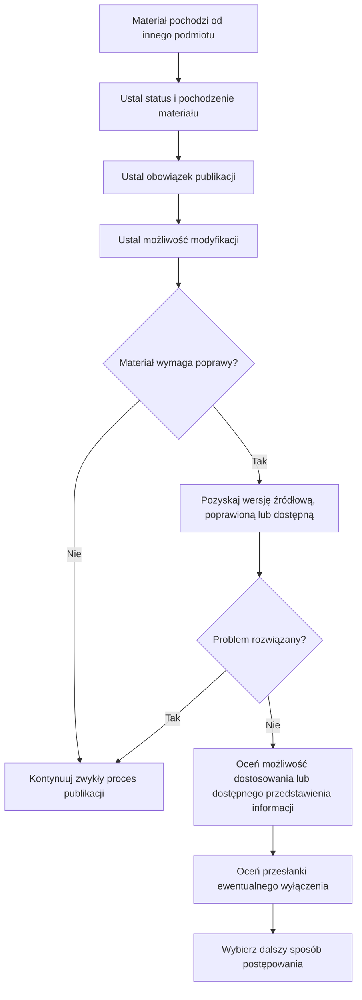

Procedura dotyczy wyłącznie dodatkowych działań wynikających z faktu, że materiał przeznaczony do publikacji pochodzi od innego podmiotu. Nie zastępuje ogólnych zasad publikacji ani kontroli dostępności cyfrowej właściwej dla danego rodzaju treści.

## 1. Ustal status i pochodzenie materiału

Ustal:

- kto wytworzył materiał;
- kto przekazał go do publikacji;
- czy został wytworzony przez podmiot publikujący albo na jego rzecz;
- czy został sfinansowany przez podmiot publikujący;
- czy został nabyty przez podmiot publikujący.

Informacje te są potrzebne do dalszej oceny materiału, w szczególności do oceny przesłanek wyłączenia określonych w przepisach o dostępności cyfrowej.

## 2. Ustal obowiązek publikacji

Ustal, czy publikacja materiału wynika z przepisu prawa albo innego wiążącego obowiązku.

Obowiązek publikacji i obowiązek zapewnienia dostępności cyfrowej ocenia się niezależnie. Sam fakt, że materiał musi zostać opublikowany, nie stanowi podstawy zastosowania wyłączenia z wymagań dostępności cyfrowej.

## 3. Ustal możliwość modyfikacji

Sprawdź:

- czy podmiot publikujący jest uprawniony do zmiany materiału;
- czy istnieją ograniczenia prawne lub faktyczne dotyczące modyfikacji;
- czy dostępna jest wersja źródłowa albo edytowalna.

Samo zewnętrzne pochodzenie materiału ani brak pliku edytowalnego nie przesądzają o braku możliwości jego dostosowania.

## 4. Jeżeli materiał wymaga poprawy, spróbuj pozyskać odpowiednią wersję

W pierwszej kolejności zwróć się do podmiotu przekazującego o:

- poprawienie materiału;
- przekazanie wersji dostępnej cyfrowo;
- przekazanie wersji źródłowej lub edytowalnej;
- uzupełnienie elementów potrzebnych do zapewnienia dostępności odpowiednich do rodzaju materiału.

W informacji o brakach wskaż konkretnie, czego brakuje, co wymaga poprawy oraz jakie materiały lub informacje są potrzebne.

Można zastosować wzór:

> W materiale „[tytuł]” stwierdziliśmy następujące braki:
>
> - [brak lub bariera];
> - [brak lub bariera].
>
> Prosimy o przekazanie [lista potrzebnych elementów lub poprawek] do [termin]. Do czasu wyjaśnienia sposobu dalszego postępowania materiał nie zostanie opublikowany w przekazanej postaci.

## 5. Oceń możliwość dostosowania lub przygotowania dostępnego przedstawienia informacji

Jeżeli podmiot przekazujący nie może dostarczyć odpowiedniej wersji, ustal:

- czy podmiot publikujący może sam dostosować materiał;
- czy możliwe jest przygotowanie dostępnej wersji;
- czy możliwe jest przygotowanie dostępnego przedstawienia zawartych w materiale informacji.

Zakres działań dobierz do rodzaju materiału i ustalonego obowiązku publikacji.

## 6. Oceń przesłanki wyłączenia

Jeżeli nadal rozważane jest zastosowanie wyłączenia, odnieś ustalony stan faktyczny do konkretnego przepisu.

Przy ocenie art. 3 ust. 2 pkt 5 ustawy o dostępności cyfrowej uwzględnij w szczególności:

- sposób wytworzenia materiału;
- sposób jego sfinansowania lub nabycia;
- konieczność dokonania modyfikacji w celu zapewnienia dostępności;
- uprawnienie podmiotu publicznego do dokonania takiej modyfikacji.

Pochodzenie materiału od innego podmiotu nie jest samoistną podstawą zastosowania wyłączenia.

## 7. Wybierz dalszy sposób postępowania

W zależności od wyników oceny możliwe jest w szczególności:

- pozyskanie poprawionej lub dostępnej wersji;
- pozyskanie wersji źródłowej albo edytowalnej;
- dostosowanie materiału przez podmiot publikujący;
- przygotowanie dostępnego przedstawienia informacji;
- publikacja materiału w zakresie dopuszczonym przez przepisy;
- wstrzymanie publikacji materiału, jeżeli publikacja nie jest obowiązkowa i nie zostały spełnione warunki pozwalające na jego prawidłowe udostępnienie.

Po ustaleniu sposobu postępowania materiał wraca do zwykłego procesu publikacji obowiązującego w podmiocie.
