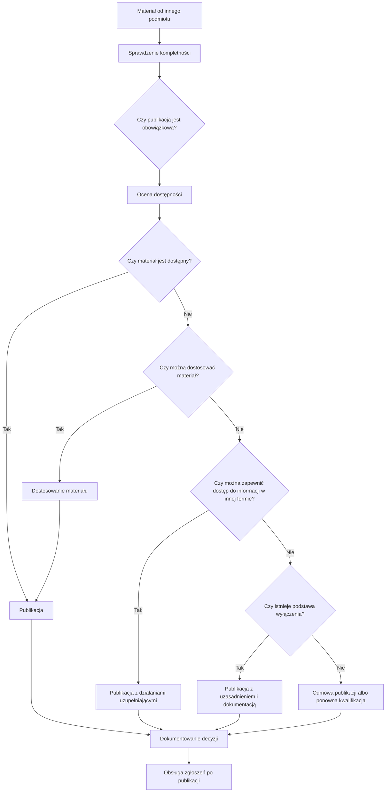

## Opis procesu

Proces publikacji materiałów pochodzących od innych podmiotów opiera się na ocenie parametrów decyzji, a nie na liniowej sekwencji „najpierw A/B/C/D, potem decyzja”.

Model A/B/C/D jest pomocniczym modelem operacyjnym, który porządkuje możliwe ścieżki postępowania. Nie zastępuje indywidualnej oceny obowiązku publikacji, możliwości dostosowania materiału, przesłanek wyłączenia oraz obowiązku zapewnienia dostępu do informacji.

Ten materiał ma charakter wdrożeniowy i wspiera stosowanie zalecenia. Nie zastępuje oceny prawnej ani indywidualnej decyzji organizacji.

Pojęcia używane w procesie wyjaśnia [słownik pojęć](./slownik-pojec.md).

## Logika procesu decyzyjnego

1. Co to za materiał?
2. Kto go wytworzył?
3. Czy podmiot publikujący może go zmienić?
4. Czy publikacja jest obowiązkowa?
5. Czy materiał spełnia wymagania dostępności?
6. Czy możliwe jest dostosowanie?
7. Czy można zapewnić dostęp do informacji w inny sposób?
8. Czy istnieją podstawy zastosowania wyłączenia?
9. Jaka decyzja jest uzasadniona?
10. Jak decyzja zostaje udokumentowana?

## Diagram procesu

## Etapy procesu

### 1. Przyjęcie i kompletność

Odpowiedzialny: redaktor

- przyjęcie materiału do publikacji,
- identyfikacja podmiotu przekazującego i źródła materiału,
- sprawdzenie kompletności plików, danych BIP, opisów, metadanych i informacji potrzebnych do oceny,
- skierowanie materiału do uzupełnienia, jeżeli braki nie pozwalają przeprowadzić oceny.

### 2. Ocena parametrów decyzji

Odpowiedzialny: redaktor
Wsparcie: koordynator dostępności lub właściciel merytoryczny, jeżeli sprawa wymaga interpretacji

Proces obejmuje ustalenie, czy materiał jest własny albo zewnętrzny, czy może zostać zmieniony, czy publikacja jest obowiązkowa, czy materiał spełnia wymagania dostępności oraz czy istnieją przesłanki wyłączenia.

Obowiązek publikacji jest odrębnym parametrem. Materiał obowiązkowy nadal podlega ocenie dostępności i wymaga działań zapewniających dostęp do informacji.

### 3. Wybór sposobu postępowania

Możliwe rozstrzygnięcia obejmują:

- publikację materiału dostępnego,
- publikację po dostosowaniu,
- publikację z dostępnym uzupełnieniem,
- publikację obowiązkową z działaniami uzupełniającymi,
- publikację z uzasadnieniem zastosowania wyłączenia,
- odmowę publikacji z uzasadnieniem,
- przekazanie do ponownej kwalifikacji.

### 4. Przygotowanie publikacji

Odpowiedzialny: redaktor

- dostosowanie materiału, jeżeli jest możliwe,
- przygotowanie dostępnego uzupełnienia, streszczenia, transkrypcji, napisów albo opisu,
- oznaczenie ograniczeń dostępności i podstaw zastosowanego trybu, jeżeli jest to potrzebne,
- uzgodnienie treści z właścicielem merytorycznym.

### 5. Dokumentowanie decyzji

Odpowiedzialny: redaktor
Nadzór: koordynator dostępności w sprawach problemowych

Dokumentacja obejmuje przyjęte parametry decyzji, wynik oceny dostępności, zastosowane działania, uzasadnienie publikacji albo odmowy oraz osobę odpowiedzialną za rozstrzygnięcie.

### 6. Etap po publikacji

Odpowiedzialny: redaktor
Wsparcie: koordynator dostępności

Po publikacji organizacja obsługuje żądania zapewnienia dostępności, wprowadza korekty, analizuje zgłoszenia jako sygnał problemu w procesie publikacji i okresowo przegląda przyjęte zasady.
