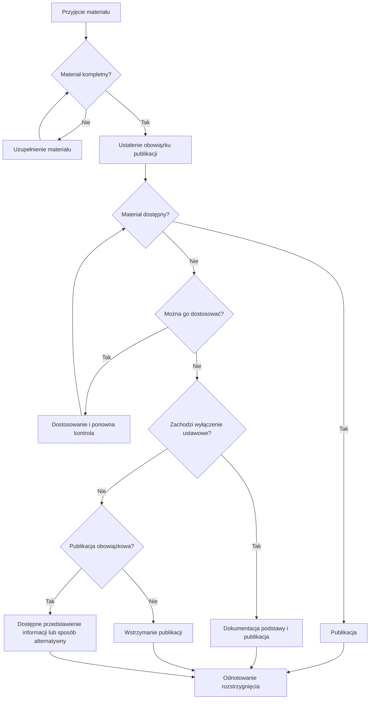

Proces opiera się na łącznej ocenie materiału, a nie na przypisaniu go do jednej kategorii.

```mermaid
flowchart TD
    A["Przyjęcie materiału"] --> B{"Materiał kompletny?"}
    B -->|Nie| C["Uzupełnienie materiału"]
    C --> B
    B -->|Tak| D["Ustalenie obowiązku publikacji"]
    D --> E{"Materiał dostępny?"}
    E -->|Tak| F["Publikacja"]
    E -->|Nie| G{"Można go dostosować?"}
    G -->|Tak| H["Dostosowanie i ponowna kontrola"]
    H --> E
    G -->|Nie| I{"Zachodzi wyłączenie ustawowe?"}
    I -->|Tak| J["Dokumentacja podstawy i publikacja"]
    I -->|Nie| K{"Publikacja obowiązkowa?"}
    K -->|Nie| L["Wstrzymanie publikacji"]
    K -->|Tak| M["Dostępne przedstawienie informacji lub sposób alternatywny"]
    F --> N["Odnotowanie rozstrzygnięcia"]
    J --> N
    L --> N
    M --> N
```

Samo stwierdzenie obowiązku publikacji nie rozstrzyga o dopuszczalności opublikowania niedostępnego materiału.

## 1. Przyjęcie materiału

Zarejestruj materiał, podmiot przekazujący, właściciela merytorycznego, planowane miejsce i termin publikacji. Sprawdź, czy przekazano pliki źródłowe, wersję edytowalną oraz informacje wymagane w BIP, jeżeli dotyczą materiału.

## 2. Ocena materiału

Przeprowadź [ocenę materiału przed publikacją](./ocena-materialu-przed-publikacja.md) oraz odpowiednią kontrolę dostępności. Wstępna lista kontrolna pomaga wykryć typowe problemy, ale nie zastępuje pełnej weryfikacji.

## 3. Usunięcie braków

Jeżeli materiał jest niekompletny albo niedostępny:

1. poproś podmiot przekazujący o poprawę, dostępną wersję lub plik edytowalny;
2. ustal, czy podmiot publikujący może sam dostosować materiał;
3. jeżeli materiał źródłowy musi pozostać niezmieniony, oceń możliwość opublikowania obok niego dostępnego przedstawienia informacji.

## 4. Obowiązek publikacji i dostępność

Obowiązek publikacji i obowiązek zapewnienia dostępności cyfrowej oceniaj niezależnie.

Jeżeli publikacja informacji jest obowiązkowa, ustal sposób wykonania tego obowiązku z zachowaniem wymagań dostępności cyfrowej. Jeżeli materiał źródłowy musi pozostać w niezmienionej postaci, sprawdź możliwość opublikowania obok niego dostępnego cyfrowo przedstawienia tych samych informacji.

Obowiązek publikacji nie stanowi samodzielnej podstawy zastosowania wyłączenia. Jeżeli zapewnienie dostępności elementu nie jest możliwe, zastosuj rozwiązanie wynikające z właściwego przepisu i udokumentuj jego podstawę.

## 5. Wyłączenie ustawowe

Nie domniemuj wyłączenia na podstawie zewnętrznego pochodzenia materiału. Wskaż konkretny przepis i fakty, które uzasadniają jego zastosowanie. Oceń również możliwość zapewnienia dostępnego przedstawienia informacji.

## 6. Wstrzymanie publikacji

Materiał fakultatywny można wstrzymać, jeżeli nie spełnia wymagań, nie można go dostosować ani uzyskać odpowiedniej wersji. Wstrzymanie jest czynnością wewnętrzną, a nie decyzją administracyjną. W notatce wskaż:

- materiał i datę oceny;
- stwierdzone problemy;
- podjęte próby ich usunięcia;
- warunki umożliwiające publikację.

## 7. Dokumentowanie

Odnotuj wynik kontroli, podstawę publikacji, zastosowane poprawki, ewentualne wyłączenie, dostępne przedstawienie informacji oraz osoby odpowiedzialne. Zakres dokumentacji dostosuj do ryzyka i złożoności sprawy.
