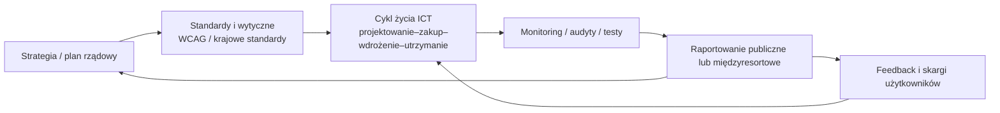
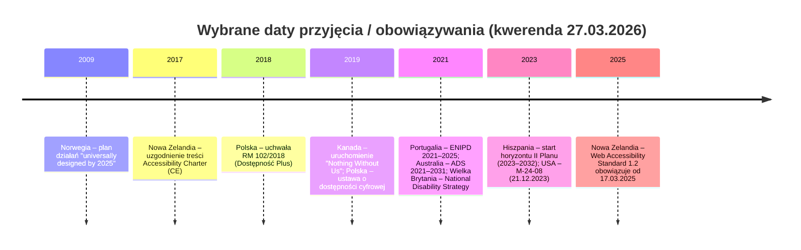

## Streszczenie dla decydentów

W ramach kwerendy (stan na 27.03.2026) zidentyfikowano zestaw państw UE i OECD, które posiadają **ogólnokrajowe dokumenty strategiczne lub programowe** zawierające **wyraźnie zdefiniowane cele, zadania oraz mechanizmy wdrożeniowe** dotyczące dostępności (w tym dostępności cyfrowej) usług publicznych i/lub ICT. W analizowanej próbie dominują dwa modele:

Model oparty o „twarde” zarządzanie i cykl życia ICT, gdzie strategia ma charakter **operacyjny, z terminami i obowiązkami raportowymi** (np. memorandum M‑24‑08 w USA z terminami 30/90/180 dni i corocznym raportowaniem). citeturn18view0  
Model oparty o **wieloletnie plany dostępności uniwersalnej / polityki wobec osób z niepełnosprawnościami**, gdzie dostępność cyfrowa jest jednym z filarów, a konkretne działania są rozpisywane w planach wykonawczych, programach sektorowych lub raportach okresowych (np. Hiszpania – II Plan 2023–2032 z trienalnym monitoringiem i ewaluacjami 2025/2028/2032; Australia – ADS 2021–2031 wspierana planami działań i ramą wskaźników). citeturn10view0turn23view0turn24search2turn22search2  

Wspólny rdzeń celów w niemal wszystkich strategiach obejmuje: (1) ujednolicone standardy dostępności (często wprost oparte o WCAG), (2) włączenie dostępności do zakupów i rozwoju ICT, (3) szkolenia i profesjonalizację kompetencji, (4) obowiązki publikacji oświadczeń/deklaracji i kanałów informacji zwrotnej, (5) monitoring i raportowanie, (6) mechanizmy koordynacji międzyresortowej i wielopoziomowej. citeturn18view0turn19search1turn6view0turn10view0turn25search6turn27view1  

Najbardziej „politycznie przenaszalne” dobre praktyki (dla Polski) to: ustanowienie **jednoznacznej odpowiedzialności (właściciel programu / program manager)** i minimalnych wymagań dokumentacyjnych (oświadczenie dostępności, proces skarg, ścieżka naprawcza), cykliczne **publiczne raportowanie** na zbiorze wspólnych wskaźników oraz zwiększenie roli dostępności w **zamówieniach publicznych** i w „governance” projektów cyfrowych. citeturn18view0turn19search1turn6view0turn10view0turn25search7  

## Zakres, definicje i metodyka kwerendy

Zakres obejmuje **państwa UE i pozostałe kraje OECD**; dodatkowo dopuszczono włączenie kraju spoza tych grup, jeśli ma „wyraźnie narodowy” dokument polityki/strategii w obszarze dostępności cyfrowej (w praktyce: dokument rządowy z zakresem krajowym, celami i mechanizmem wdrożenia). entity["organization","OECD","intergovernmental org"]  

Na potrzeby raportu przyjęto roboczą definicję „strategii dostępności cyfrowej” jako:  
„przyjęty lub ogłoszony przez rząd (albo formalnie zatwierdzony w administracji centralnej) dokument strategiczny/programowy, który obejmuje dostępność ICT i usług cyfrowych co najmniej w sektorze publicznym, a równocześnie zawiera: cele, listę działań (lub mechanizm ich generowania), role/odpowiedzialności oraz elementy monitoringu”.

Metodyka: kwerenda dokumentów pierwotnych (PDF/HTML), w pierwszej kolejności źródeł rządowych. Tam, gdzie dokument jest **szerszą strategią dostępności uniwersalnej**, w raporcie wyodrębniono fragmenty odnoszące się do środowiska cyfrowego, ICT, komunikacji i usług online. citeturn10view0turn12view0turn27view1turn20view0turn25search6turn38view0  

Ograniczenia: (1) terminologia jest niejednorodna (strategie „accessibility”, „universal design”, „disability strategy”, „digital accessibility”), (2) część państw wdraża dostępność przede wszystkim poprzez prawo i standardy bez jednego dokumentu strategicznego nazwanego „strategią” — takie przypadki mogły nie zostać ujęte, jeśli brak było jednoznacznego dokumentu z celami i listą działań, (3) jeżeli w źródłach brakowało detalu (np. finansowania), oznaczono go jako **„nieokreślone”** zgodnie z wymogiem użytkownika. citeturn6view0turn19search8turn25search3turn28search25  

## Przegląd porównawczy

Poniżej przedstawiono tabelę porównawczą (skróconą) obejmującą państwa, dla których w kwerendzie potwierdzono istnienie **ogólnokrajowego dokumentu** z komponentem dostępności cyfrowej oraz minimalnym aparatem wdrożeniowym. Kategorie celów są kodowaniem autorskim na podstawie treści dokumentów. citeturn18view0turn10view0turn12view0turn27view1turn25search6turn23view0turn38view0turn6view0turn20view0turn16view0turn7view0  

| Kraj | Główny instrument strategiczny (horyzont) | Dominujące kategorie celów | Przykładowe zadania i terminy (wybrane) |
|---|---|---|---|
| Polska | Program „Dostępność Plus 2018–2025” + reżim prawny dostępności cyfrowej | standardy/zgodność, inwestycje i modernizacja, kompetencje, monitoring | terminy obowiązywania dostępności stron (23.09.2020) i aplikacji (23.06.2021) w sektorze publicznym; program definiuje dostępność także jako „rzeczywistość cyfrową” |
| Niemcy | Federalna inicjatywa dostępności (Eckpunkte) | governance, prawo/polityka, cyfryzacja bez barier | wskazane kamienie milowe (np. redukcja wyjątków do 2026; cele infrastrukturalne do 2030) oraz mechanizmy sterowania |
| Niderlandy | Polityka „digitale toegankelijkheid” + wymogi prawne | zgodność/standard, oświadczenia, monitoring/dashboards | trzy‑krokowy model: „zrób dostępne → opublikuj oświadczenie → utrzymuj i poprawiaj”; monitoring poprzez dashboardy |
| Hiszpania | II Plan Nacional de Accesibilidad Universal (2023–2032) | governance, standardy, szkolenia, kontrola i ewaluacja | trienalne raporty postępu (2025, 2028) oraz ewaluacja końcowa 2032; działania obejmują m.in. dostępność cyfrową i dokumentalną administracji |
| Norwegia | Action Plan „Norway universally designed by 2025” (2009; plan 5‑letni) | universal design w ICT, standardy, wskaźniki, finansowanie z budżetów | deadline: nowe ICT od 2011, istniejące ICT do 2021; start systemu wskaźników od 2009 |
| Portugalia | ENIPD 2021–2025 | dostępność ICT i komunikacji, governance, plany sektorowe | mechanizm: plany sektorowe z wskaźnikami i budżetem; m.in. program szkoleń TIC/literacia digital |
| Kanada | „Nothing Without Us” – Accessibility Strategy (w sektorze federalnym) | ICT usable by all, usługi, kultura, pomiar postępu | stan „do 2021”: zebrane i opublikowane dane bazowe nt. satysfakcji klientów z niepełnosprawnościami; działania w pięciu celach |
| USA | OMB M‑24‑08 (od 21.12.2023) | programy 508, procurement, oświadczenia, feedback, raportowanie | 30 dni: zgłoszenie program managera; 90 dni: oświadczenia i feedback; 180 dni: przegląd polityk; coroczne raportowanie do OMB/GSA |
| Wielka Brytania | National Disability Strategy (2021) + regulacje dostępności 2018 + monitoring GDS | program poprawy usług online, skills gap, monitoring zgodności | monitoring 2022–IX.2024 raportowany przez GDS; strategia: program poprawy dostępności usług online i działania na „skills gap” |
| Nowa Zelandia | Accessibility Charter (2017/2018; horyzont 5 lat) + Web Accessibility Standard 1.2 (od 17.03.2025) | zobowiązanie kierownictwa, standardy web, self‑assessment, narzędzia | Charter: praca „progressively over the next five years”; Standard 1.2: obowiązuje od 17.03.2025, wymaga WCAG 2.2; plan przejścia do Digital Accessibility Standard |
| Australia | Australia’s Disability Strategy 2021–2031 + Targeted Action Plans + Outcomes Framework | cele wielopoziomowe, raportowanie, plany działań, wskaźniki | instrumenty wdrożeniowe: fora roczne 2022–2031; TAP 2025–2027 zawierają konkretne działania (np. aktualizacja serwisów do WCAG 2.2 i wskaźniki) |

Mermaid – schemat „łańcucha polityki” spotykany w większości analizowanych strategii (standardy → wdrożenie → monitoring → korekta): citeturn18view0turn19search1turn6view0turn25search7turn10view0  

Mermaid – oś czasu (wybrane daty z analizowanych dokumentów): citeturn13view1turn25search2turn32view0turn16view0turn26view0turn23view0turn10view0turn18view0turn25search6  

## Profile strategiczne państw

Poniższe profile stosują jednolity szablon. Jeżeli informacja nie występowała w źródłach pierwotnych lub nie była możliwa do wiarygodnego wywnioskowania, oznaczono ją jako **„nieokreślone”**.

**entity["country","Polska","country in europe"]**

Rok przyjęcia: 2018 (program rządowy), 2019 (ustawa dot. dostępności cyfrowej), 2021 (strategia dot. osób z niepełnosprawnościami). citeturn32view0turn28search14turn28search13turn28search5turn38view0  
Tytuł i URL:  
- „Program Dostępność Plus” (załącznik do uchwały RM) – `https://www.gov.pl/documents/33377/436740/Program_Dostepnosc_Plus.pdf/80a95233-3306-4601-3afb-11d4a2661b82` citeturn38view0turn37search2  
- Ustawa o dostępności cyfrowej stron i aplikacji podmiotów publicznych – `https://eli.gov.pl/eli/DU/2019/848/ogl` citeturn28search14  
- „Strategia na rzecz Osób z Niepełnosprawnościami 2021–2030” (uchwała RM nr 27/2021) – `https://eli.gov.pl/eli/MP/2021/218/ogl` citeturn28search13  

Zakres: krajowy (program rządowy i strategia rozwoju); ustawa – krajowy reżim dla podmiotów publicznych. citeturn32view0turn28search13turn28search14  

Cele strategiczne (w części istotnej dla cyfryzacji/dostępności):  
- Ujęcie dostępności jako cechy środowiska obejmującej „rzeczywistość cyfrową” i systemy informacyjno‑komunikacyjne. citeturn38view0  
- Systemowe działania prawne i organizacyjne na rzecz wyrównywania szans w dostępie do usług i produktów, w tym usług cyfrowych. citeturn38view0  

Zadania / środki i harmonogram (komponent cyfrowy):  
- Obowiązywanie terminów dostępności cyfrowej dla stron internetowych (od 23.09.2020) i aplikacji mobilnych (od 23.06.2021) w sektorze publicznym. citeturn28search25  
- Instrumenty wykonawcze po stronie podmiotów: m.in. deklaracje/oświadczenia dostępności i wymagania wobec treści/usług (szczegóły: w ustawie – nieprzytoczone w całości w tej kwerendzie). citeturn28search14turn28search25  

Zarządzanie i finansowanie:  
- Koordynacja programu powierzona ministrowi właściwemu ds. rozwoju regionalnego (uchwała RM 102/2018). citeturn32view0  
- Szczegółowe mechanizmy finansowania w programie: „FINANSOWANIE” jako osobna część dokumentu (kwoty/źródła: nieokreślone w wyciągach tekstu użytych w raporcie). citeturn38view0  

Monitoring / wskaźniki:  
- Program przewiduje rozdział „MONITOROWANIE I EWALUACJA” (szczegółowe wskaźniki: nieokreślone w wyciągach). citeturn38view0  
- Ustawa ustanawia reżim wymagań i terminów; szczegółowe zobowiązania monitoringu na poziomie centralnym w przywołanych źródłach: nieokreślone. citeturn28search14turn28search25  

Powiązane instrumenty prawno‑polityczne:  
- Ustawa o dostępności cyfrowej (2019). citeturn28search14  
- Strategia na rzecz osób z niepełnosprawnościami (2021–2030). citeturn28search13turn28search5  

Stan wdrożenia / postępy: nieokreślone (w tej kwerendzie nie analizowano sprawozdań z wykonania programu ani raportów monitoringu ustawy na poziomie krajowym).

**entity["country","Niemcy","country in europe"]**

Rok przyjęcia: nieokreślone (dokument „Eckpunkte” nie został w cytowanych wyciągach opatrzony jednoznaczną datą przyjęcia). citeturn7view0turn3search5  
Tytuł i URL: „Eckpunkte zur Bundesinitiative Barrierefreiheit” – `https://www.bmas.de/SharedDocs/Downloads/DE/Publikationen/a740-24-eckpunkte-bundesinitiative-barrierefreiheit.pdf?__blob=publicationFile&v=2` citeturn7view0turn3search5  
Zakres: federalny, ogólnokrajowy (inicjatywa rządu federalnego). citeturn3search5turn7view0  

Cele strategiczne (wybór):  
- Ustanowienie ram działań na rzecz „Barrierefreiheit” (dostępności) jako priorytetu państwa, w tym w obszarze cyfrowym (szczegółowy katalog celów: nieokreślone w trybie cytowania fragmentów). citeturn7view0turn3search5  

Zadania / środki i harmonogram (wybór z Eckpunkte):  
- Wskazane konkretne kamienie milowe (np. działania prowadzące do ograniczania wyjątków do 2026 oraz cele infrastruktury do 2030). citeturn7view0  

Zarządzanie i finansowanie:  
- Dokument opisuje mechanikę wdrożenia inicjatywy (role/fora sterujące – szczegóły: częściowo nieokreślone w wyciągach). citeturn7view0  

Monitoring / wskaźniki: nieokreślone (w przywołanych wyciągach brak jednoznacznej listy wskaźników). citeturn7view0  

Powiązane instrumenty prawno‑polityczne: nieokreślone w cytowanych fragmentach (w praktyce Niemcy posiadają liczne akty w zakresie dostępności, jednak bez cytatu z dokumentu źródłowego nie są tu enumerowane).  

Stan wdrożenia / postępy: istnieje publiczny „Zwischenbericht 2025” (raport śródokresowy) na portalu rządowym. citeturn3search7  

**entity["country","Niderlandy","country in europe"]**

Rok przyjęcia: 2018 (wdrożenie / umocowanie wymogów m.in. w „Tijdelijk besluit digitale toegankelijkheid overheid” – akt prawny/rozporządzenie tymczasowe). citeturn3search4  
Tytuł i URL (polityka i umocowanie):  
- Polityka rządowa „Digitale toegankelijkheid” (opis wdrożenia) – `https://www.digitaleoverheid.nl/overheid-ict/digitale-toegankelijkheid/` citeturn6view0turn5view1  
- „Tijdelijk besluit digitale toegankelijkheid overheid” – `https://wetten.overheid.nl/BWBR0040936/` citeturn3search4  

Zakres: krajowy (administracja publiczna; monitorowanie zgodności poprzez centralne narzędzia). citeturn6view0turn5view1  

Cele strategiczne:  
- Powszechna dostępność cyfrowa stron i aplikacji administracji („digitale toegankelijkheid”). citeturn6view0turn5view1  
- Przejrzystość w zakresie stanu zgodności poprzez publikowanie oświadczeń dostępności. citeturn6view0turn5view1  
- Utrzymywanie i systematyczne ulepszanie dostępności (nie jako jednorazowy projekt). citeturn6view0turn5view1  

Zadania / środki i harmonogram:  
- Model „3 kroki”: (1) uczynić stronę/aplikację dostępną, (2) opublikować oświadczenie o dostępności, (3) utrzymywać i poprawiać dostępność. citeturn6view0turn5view1  
- Wsparcie monitoringu i zarządzania zgodnością przez instrumenty typu dashboard (konkretne KPI: nieokreślone w cytowanych fragmentach). citeturn6view0turn5view1  

Zarządzanie i finansowanie:  
- W cytowanych fragmentach polityka jest opisana jako rządowe podejście operacyjne; mechanizmy finansowania: nieokreślone. citeturn6view0turn5view1  

Monitoring / wskaźniki:  
- Monitoring stanu dostępności i publikacja wyników poprzez centralne zestawienia/dashboards. citeturn6view0turn5view1  

Powiązane instrumenty prawno‑polityczne:  
- Tymczasowe rozporządzenie o dostępności cyfrowej administracji (2018). citeturn3search4  

Stan wdrożenia / postępy: nieokreślone (w cytowanych fragmentach brak jednolitego, liczbowego wyniku; mechanizm monitoringu jest wskazany). citeturn6view0turn5view1  

**entity["country","Hiszpania","country in europe"]**

Rok przyjęcia: 2023 (start horyzontu planu 2023–2032). citeturn10view0  
Tytuł i URL: „II Plan Nacional de Accesibilidad Universal. España País Accesible” – `https://www.rpdiscapacidad.gob.es/estudios-publicaciones/PlanNacionalAccesibilidad.pdf` citeturn8view0turn10view0  
Zakres: krajowy (Administración General del Estado – AGE; plan ogólnokrajowy w administracji centralnej, z komponentem wielopoziomowym). citeturn8view0turn10view0  

Cele strategiczne (struktura osi):  
- Widoczny i trwały „commitment” państwa w zakresie dostępności uniwersalnej oraz zasoby/struktury dla wdrożenia. citeturn8view0  
- Systemowe włączenie dostępności do zarządzania i praktyk administracji. citeturn8view0  
- Wzmocnienie ram normatywnych i egzekwowania dostępności. citeturn8view0  
- Mechanizmy analiz i diagnozy poziomu wdrożenia oraz ewaluacji. citeturn8view0  
- Wprost wskazany komponent TIC (web, apps, software, sieci komunikacyjne) jako obszar zapewnienia dostępności. citeturn8view0  

Zadania / środki i harmonogram (wybór, z perspektywy cyfrowej):  
- Horyzont planu 2023–2032; zaplanowane raporty postępu: 2025 i 2028; ewaluacja końcowa 2032. citeturn10view0  
- Zapewnienie dostępności cyfrowej i dokumentalnej w AGE zgodnie z obowiązującymi normami („accesibilidad digital y documental”). citeturn8view0  
- Budżet planu jest rozpisany według osi strategicznych (wartości liczbowe budżetu: obecne w dokumencie; w streszczeniu podano rozkład według osi). citeturn8view0  

Zarządzanie i finansowanie:  
- Plan zakłada struktury koordynacyjne (m.in. mechanizmy odpowiedzialności między ministerstwami) oraz budżetowanie według osi. citeturn8view0  

Monitoring / wskaźniki:  
- Monitoring trienalny i ewaluacje w cyklu 2025/2028/2032. citeturn10view0  

Powiązane instrumenty prawno‑polityczne:  
- W dokumencie zebrano kontekst normatywny, w tym odniesienie do dyrektywy (UE) 2019/882 dot. wymogów dostępności produktów i usług. citeturn10view0  

Stan wdrożenia / postępy: nieokreślone (plan jest skonstruowany z mechanizmem raportów postępu w 2025 i 2028; brak w tej kwerendzie analizy raportów wykonania). citeturn10view0  

**entity["country","Norwegia","country in europe"]**

Rok przyjęcia: 2009 (materialnie: publikacja 09/2009; plan pięcioletni). citeturn13view1turn13view3  
Tytuł i URL: „Norway universally designed by 2025. The Government’s action plan for universal design and increased accessibility 2009–2013” – `https://www.regjeringen.no/globalassets/upload/bld/nedsatt-funksjonsevne/norway-universally-designed-by-2025-web.pdf` citeturn11view0turn13view0turn13view1  
Zakres: krajowy, międzyresortowy (16 ministerstw). citeturn13view3turn11view0  

Cele strategiczne:  
- „Universally designed society by 2025” z priorytetami w czterech obszarach, w tym ICT. citeturn11view0turn13view3turn12view0  
- Wsparcie wdrażania nowych ustaw i regulacji związanych z dostępnością/universal design. citeturn11view0turn13view3  
- Budowa wskaźników i standardów jako podstawa zarządzania programem. citeturn12view1turn12view2  

Zadania / środki i harmonogram (ICT):  
- Deadline’owe cele w ICT: nowe ICT dla ogółu społeczeństwa „as from 2011”, istniejące ICT „by 2021”. citeturn12view0  
- Rozwój standardów/wytycznych i podstawy regulacyjnej do 1.07.2010 jako etap wdrożenia wymogów ICT. citeturn12view0  
- System wskaźników universal design (w tym ICT) – plan uruchomienia od 2009. citeturn12view1  

Zarządzanie i finansowanie:  
- Koordynacja: Ministerstwo ds. Dzieci i Równości (Ministry of Children and Equality), z zakotwiczeniem politycznym w komitecie sekretarzy parlamentarnych; roczny przegląd planu i ewaluacja. citeturn13view3  
- Zasada finansowania: „within ordinary budget frameworks”; dodatkowo wskazano konkretne środki na follow‑up planu (NOK 18.6 million) i inne pakiety sektorowe. citeturn11view0turn13view3  

Monitoring / wskaźniki:  
- Uruchomienie systemu wskaźników, integracja danych z rejestrami i podejście oparte o dokumentowanie postępu. citeturn12view2turn12view1  

Powiązane instrumenty prawno‑polityczne:  
- Odwołania do ustaw antydyskryminacyjnych i planowania/budownictwa oraz do obowiązków międzynarodowych (UN CRPD). citeturn11view0turn13view3  

Stan wdrożenia / postępy: plan zawiera kontekst wcześniejszych ewaluacji (2005–2008) i wskazuje postęp oraz luki, ale nie zawiera w tej kwerendzie aktualnego (po 2013) statusu realizacji. citeturn11view0turn13view3  

**entity["country","Portugalia","country in europe"]**

Rok przyjęcia: 2021 (ENIPD 2021–2025 zatwierdzona uchwałą Rady Ministrów; dokument zawiera postanowienia o wejściu w życie). citeturn26view0  
Tytuł i URL: „Estratégia Nacional para a Inclusão das Pessoas com Deficiência 2021–2025 (ENIPD 2021–2025)” – `https://www.inr.pt/documents/11309/284924/ENIPD.pdf` citeturn26view0  
Zakres: krajowy; wdrożenie poprzez działania sektorowe („Planos de Ação Setoriais”). citeturn26view0turn27view1  

Cele strategiczne (wątek cyfrowy/ICT):  
- Podkreślenie „centralnej roli dostępności” jako warunku udziału w społeczeństwie i gospodarce, wprost obejmującej dostępność transportu, przestrzeni i **Technologias de Informação e Comunicação (TIC)**. citeturn27view1  
- Cel ogólny w osi „Promover ambientes físicos e de informação e comunicação acessíveis”, z celami szczegółowymi obejmującymi dostępność informacji i komunikacji. citeturn27view1turn26view0  

Zadania / środki i harmonogram:  
- Mechanizm wdrożeniowy wymagający, aby plany sektorowe zawierały: odpowiedzialności, wskaźniki, poziomy bazowe, roczne cele i budżet (termin przekazania planów do INR: do 31 grudnia — rok nieokreślony w cytowanym fragmencie). citeturn26view0  
- Przykładowa miara o charakterze cyfrowym: stworzenie programu szkoleń w TIC/literacia digital dla osób z niepełnosprawnościami (koncepcja, zatwierdzenie i implementacja). citeturn27view0turn27view1  

Zarządzanie i finansowanie:  
- Koordynator: Instituto Nacional para a Reabilitação (INR, I.P.), wspierany przez Komisję Monitorującą (spotkania roczne) oraz Grupę Techniczną (spotkania kwartalne). citeturn26view0  
- Finansowanie: realizacja środków ma być zapewniona przez właściwe podmioty poprzez alokację zasobów finansowych, ludzkich i materialnych (bez odrębnej puli centralnej w cytowanych fragmentach). citeturn26view0  

Monitoring / wskaźniki:  
- Mechanizm raportów rocznych i przeglądu/rekomendacji rewizji środków, a także przygotowania strategii kontynuacji przed końcem obowiązywania ENIPD. citeturn26view0  

Powiązane instrumenty prawno‑polityczne:  
- Dokument odwołuje się m.in. do zakazu dyskryminacji (Lei n.º 46/2006) i do zobowiązań międzynarodowych. citeturn26view0  

Stan wdrożenia / postępy: nieokreślone (w kwerendzie nie analizowano raportów wykonania ENIPD).

**entity["country","Kanada","country in north america"]**

Rok przyjęcia: 2019 (uruchomienie strategii jako „roadmap” dla federalnej służby publicznej; raport postępu obejmuje 2019–20). citeturn16view0  
Tytuł i URL:  
- „Nothing Without Us: Accessibility Strategy for the Public Service of Canada” (publikacja na Canada.ca; pełny PDF z repozytorium publikacji rządowych był chwilowo niedostępny technicznie w kwerendzie, więc cytowano wersję web i raport postępu). citeturn15view0turn16view0  
- Przykład rozdziału strategii (Services): `https://www.canada.ca/en/government/publicservice/wellness-inclusion-diversity-public-service/diversity-inclusion-public-service/accessibility-public-service/accessibility-strategy-public-service-toc/accessibility-strategy-public-service-services.html` citeturn15view0  

Zakres: federalny (public service – administracja federalna). citeturn16view0turn15view0  

Cele strategiczne (pięć celów strategii):  
- Rekrutacja, retencja i awans osób z niepełnosprawnościami. citeturn16view0  
- Dostępność środowiska budynkowego. citeturn16view0  
- Użyteczność ICT dla wszystkich. citeturn16view0  
- Zdolność projektowania i świadczenia dostępnych programów i usług. citeturn16view0turn15view0  
- Budowa kultury „accessibility‑confident”. citeturn16view0  

Zadania / środki i harmonogram (wybór):  
- Dla obszaru usług (Goal 4) strategia wyznacza działania „What we will do next” oraz oczekiwany stan „Where we expect to be in 2021” (m.in. baseline danych nt. satysfakcji klientów z niepełnosprawnościami, mechanizmy konsultacji i feedbacku). citeturn15view0  
- Raport postępu wskazuje m.in. cel zatrudnienia „5,000 net new employees with disabilities by 2025” jako element szerszego programu działań. citeturn16view0  

Zarządzanie i finansowanie:  
- Raport postępu opisuje model wdrożenia (w tym działania horyzontalne i narzędzia wsparcia); dedykowane mechanizmy finansowania w cytowanych fragmentach: nieokreślone. citeturn16view0  

Monitoring / wskaźniki:  
- Zasada „Transparency” i raportowanie postępów; rozwój narzędzia samooceny organizacyjnej do pomiaru postępu względem pięciu celów strategii. citeturn16view0  

Powiązane instrumenty prawno‑polityczne:  
- Strategia jest powiązana z wejściem w życie Accessible Canada Act (2019) oraz ma stanowić odpowiedź/„roadmap” dla sektora publicznego. citeturn16view0  

Stan wdrożenia / postępy: dostępny raport postępu 2019–20 (publikacja 17.12.2020). citeturn16view0  

**entity["country","Stany Zjednoczone","country in north america"]**

Rok przyjęcia: 2023 (memorandum datowane 21.12.2023; numer M‑24‑08). citeturn18view0  
Tytuł i URL: „M‑24‑08: Strengthening Digital Accessibility and the Management of Section 508 of the Rehabilitation Act” – `https://www.whitehouse.gov/wp-content/uploads/2023/12/M-24-08-Strengthening-Digital-Accessibility-and-the-Management-of-Section-508-of-the-Rehabilitation-Act.pdf` citeturn18view0  
Zakres: federalny (agencje podlegające Section 508; z wyłączeniem systemów narodowego bezpieczeństwa, ale z zachętą do stosowania tam, gdzie możliwe). citeturn18view0  

Cele strategiczne:  
- Utrzymanie dostępnego środowiska technologicznego rządu federalnego, promowanie dostępnych doświadczeń cyfrowych i kontynuacja wdrażania standardów dostępności zgodnie z Section 508. citeturn18view0  
- Zinstytucjonalizowanie programów dostępności cyfrowej (roles, resources, policies). citeturn18view0  

Zadania / środki i harmonogram (najbardziej „operacyjny” element strategii):  
- 30 dni od wydania: agencje raportują do OMB dane „agency‑wide Section 508 program manager”. citeturn18view0  
- 90 dni: ustanowienie/aktualizacja oświadczeń dostępności na stronach agencji oraz mechanizmu publicznego feedbacku (skargi/zgłoszenia) i rozpoczęcie ich obsługi. citeturn18view0  
- 180 dni: kompleksowy przegląd polityk agencji pod kątem integracji dostępności ICT oraz plan aktualizacji polityk; udostępnienie polityk publicznie. citeturn18view0  
- Corocznie: raportowanie zgodności z Section 508 do OMB i GSA. citeturn18view0  
- Dodatkowo: działania „government‑wide” (np. w ciągu roku: standaryzacja raportów zgodności dla zakupów; uruchomienie usług wsparcia dostępności jako usługi). citeturn18view0  

Zarządzanie i finansowanie:  
- CIO zapewnia przywództwo programu; obowiązek ustanowienia programu 508 z zasobami oraz współpracy z kluczowymi funkcjami (zakupy, HR, prawo). citeturn18view0  
- Dedicated resources wskazane jako warunek skuteczności (konkretne kwoty: nieokreślone). citeturn18view0  

Monitoring / wskaźniki:  
- Wymóg corocznego raportowania zgodności; wymagania proceduralne dot. testów, skarg i śledzenia zgłoszeń. citeturn18view0  

Powiązane instrumenty prawno‑polityczne:  
- Section 508 (Rehabilitation Act) jako podstawa; memorandum rescinduje wcześniejsze memo OMB dot. zarządzania 508. citeturn18view0  

Stan wdrożenia / postępy: nieokreślone (w kwerendzie nie analizowano rocznych raportów ze zgodności po wejściu M‑24‑08 w życie).

**entity["country","Wielka Brytania","country in europe"]**

Rok przyjęcia: 2021 (National Disability Strategy); równolegle: 2018 (Accessibility Regulations). citeturn19search0turn19search8  
Tytuł i URL:  
- „National Disability Strategy” – `https://assets.publishing.service.gov.uk/media/60fff9b8d3bf7f0452a7a939/National-Disability-Strategy_web-accesible-pdf.pdf` citeturn20view0  
- „The Public Sector Bodies (Websites and Mobile Applications) (No. 2) Accessibility Regulations 2018” – `https://www.legislation.gov.uk/uksi/2018/952/contents` citeturn19search8  
- Raport z monitoringu 2022–IX.2024 – `https://www.gov.uk/government/publications/accessibility-monitoring-of-public-sector-websites-and-mobile-apps-from-2022-to-2024/accessibility-monitoring-of-public-sector-websites-and-mobile-apps-from-2022-to-2024` citeturn19search1  

Zakres: krajowy (regulacje dotyczą sektora publicznego; strategia obejmuje działania rządu UK). citeturn19search1turn19search8turn20view0  

Cele strategiczne (wątek cyfrowy):  
- Program poprawy dostępności usług publicznych online („deliver a programme to improve the accessibility of online public services”). citeturn20view0  
- Zmniejszenie „Accessible Technology Skills Gap” poprzez działania międzyresortowe: zdefiniowanie profesji dostępności, budowa pipeline’u talentów, oraz poprawa zakupów produktów/usług cyfrowych. citeturn20view0  

Zadania / środki i harmonogram:  
- Strategia wskazuje działania „This year…” w zakresie kampanii i wsparcia dostępności aplikacji oraz podnoszenia świadomości skarg; konkretne daty w strategii: nieokreślone poza odniesieniem do działań „w tym roku”. citeturn20view0  
- Regulacje 2018 ustanawiają obowiązek dostępności oraz mechanizm monitorowania; monitoring jest realizowany przez GDS i raportowany (w raporcie: okres styczeń 2022 – wrzesień 2024). citeturn19search1turn19search38turn19search8  

Zarządzanie i finansowanie:  
- Monitoring zgodności pod regulacjami prowadzony przez GDS; finansowanie centralne działań: nieokreślone w cytowanych fragmentach. citeturn19search1turn19search4  

Monitoring / wskaźniki:  
- Raport monitoringu przedstawia wyniki monitorowania zgodności z regulacjami 2018 (szczegółowe wskaźniki w raporcie: nieanalizowane w tej kwerendzie). citeturn19search1  

Powiązane instrumenty prawno‑polityczne:  
- Regulacje 2018 (implementują podejście do dostępności w sektorze publicznym) i obowiązek monitorowania i raportowania. citeturn19search8turn19search38  

Stan wdrożenia / postępy: potwierdzony publiczny raport monitoringu 2022–2024. citeturn19search1  

**entity["country","Nowa Zelandia","country in oceania"]**

Rok przyjęcia: 2017 (treść Accessibility Charter uzgodniona przez chief executives), uruchomienie programu: 2018; standard web 1.2 obowiązuje od 17.03.2025. citeturn25search2turn25search6  
Tytuł i URL:  
- „Accessibility Charter” (PDF) – `https://www.msd.govt.nz/documents/about-msd-and-our-work/work-programmes/accessibility/accessibility-charter-2.pdf` citeturn25search4  
- Opis programu i wdrożenia charter – `https://msd.govt.nz/about-msd-and-our-work/work-programmes/accessibility/accessibility-guide/about-the-charter.html` citeturn25search2  
- „NZ Government Web Accessibility Standard 1.2” – `https://www.digital.govt.nz/standards-and-guidance/nz-government-web-standards/web-accessibility-standard-1-2` citeturn25search6  

Zakres: międzyagencyjny w sektorze publicznym; Web Accessibility Standard dotyczy departamentów i jednostek w executive branch (standard obowiązkowy). citeturn25search6turn25search3  

Cele strategiczne:  
- Pięcioletnie zobowiązanie kierownictwa administracji do zapewnienia, aby informacja dla publiczności była dostępna i aby obywatele mogli korzystać z usług w sposób wspierający niezależność i godność. citeturn25search2turn25search4  
- Standaryzacja dostępności web (i w praktyce konwergencja do WCAG; wersja 1.2 wymaga WCAG 2.2). citeturn25search16turn25search6  
- Przygotowanie do rozszerzenia standardu z „web” do szerszego „Digital Accessibility Standard” obejmującego dokumenty poza-web i aplikacje mobilne. citeturn25search13  

Zadania / środki i harmonogram (wybór):  
- Charter: „working progressively over the next five years” – deklaracja kierownictwa; zawiera przykładowo zobowiązanie do spełniania Web Accessibility Standard i Web Usability Standard. citeturn25search4turn25search2  
- Web Accessibility Standard 1.2: obowiązuje od 17.03.2025 i zastępuje 1.1; wymaga zgodności z WCAG 2.2. citeturn25search6turn25search16  

Zarządzanie i finansowanie:  
- Model oparty o podpisy i sponsorów (w opisie wdrożenia charter wskazano zalecany proces implementacji, m.in. formalne endorsowanie zobowiązania i wyznaczanie sponsora). citeturn25search2  
- Finansowanie: nieokreślone w przywołanych dokumentach (brak wskazania dedykowanej puli). citeturn25search2turn25search6  

Monitoring / wskaźniki:  
- W standardach web i w ekosystemie wdrożeniowym funkcjonują mechanizmy samooceny i zarządzania ryzykiem zgodności (szczegóły: „Web Standards Self‑Assessments” i „risk assessment” jako element standardów – niecytowane w całości). citeturn25search7turn25search3  

Powiązane instrumenty prawno‑polityczne:  
- Charter jest osadzone jako program pod New Zealand Disability Action Plan, wskazany w opisie charter. citeturn25search2  

Stan wdrożenia / postępy: trwają prace nad zastąpieniem Web Accessibility Standard przez Digital Accessibility Standard (post ogłoszony 07.07.2025). citeturn25search13  

**entity["country","Australia","country in oceania"]**

Rok przyjęcia: 2021 (porozumienie między rządami wszystkich poziomów podpisane 3.12.2021). citeturn23view0  
Tytuł i URL:  
- „Australia’s Disability Strategy 2021–2031” – `https://www.disabilitygateway.gov.au/sites/default/files/documents/2021-11/1786-australias-disability.pdf` citeturn23view0  
- Przykład wdrożeniowego planu działań (TAP): „Inclusive Homes and Communities Targeted Action Plan” – `https://www.disabilitygateway.gov.au/sites/default/files/documents/2025-01/5801-taps-inclusive-homes-and.pdf` citeturn24search2  
- Postęp (ramy wyników): AIHW – „Outcomes Framework: 4th annual report” (wydany 30.01.2026) – `https://www.aihw.gov.au/australias-disability-strategy` citeturn22search2  

Zakres: krajowy, wielopoziomowy (Commonwealth + stany/terytoria + samorządy). citeturn23view0  

Cele strategiczne (meta‑poziom) istotne dla cyfrowej dostępności:  
- Strategia jest „policy framework” na 10 lat z wbudowanym raportowaniem i ewaluacją; opiera się na outcome areas i policy priorities. citeturn23view0  
- Mechanizmy wdrożeniowe: Engagement Plan (w tym Advisory Council i coroczne fora 2022–2031) oraz Reporting/Outcomes Framework. citeturn23view0  

Zadania / środki i harmonogram (konkrety w TAP):  
- TAP „Inclusive Homes and Communities” zawiera działania z polami: cel, działanie, wskaźnik, timeframe; przykładowo: modernizacja serwisów i materiałów cyfrowych do standardu WCAG 2.2 i poprawa dostępności (czas: grudzień 2024 – ongoing). citeturn24search2  

Zarządzanie i finansowanie:  
- Governance: strategiczny nadzór poprzez forum dyrektorów (Deputy Department Heads) i wsparcie ministrów; zaangażowanie Advisory Council; coroczne fora publiczne. citeturn23view0  
- Finansowanie: nieokreślone na poziomie jednej kwoty centralnej w cytowanych fragmentach; działania są realizowane przez podmioty i jurysdykcje w ramach TAP i planów powiązanych. citeturn23view0turn24search2  

Monitoring / wskaźniki:  
- Outcomes Framework raportowany przez AIHW, w tym coroczne raporty (np. 4th annual report, wydany 30.01.2026). citeturn22search2  

Powiązane instrumenty prawno‑polityczne:  
- Strategia jest umieszczona w kontekście zobowiązań wynikających z UN CRPD (jako rama realizacji praw). citeturn23view0  

Stan wdrożenia / postępy: według opisu AIHW, raporty roczne podsumowują postęp na zestawie miar (np. aktualizacje statusu postępu dla części miar oraz pojawienie się nowych danych). citeturn22search2  

## Wnioski, luki i dobre praktyki

Najsilniejsze wspólne wzorce:

„Dostępność jako proces” (nie projekt): strategie wprost zakładają stałą poprawę, cykle raportowania i ewaluacje (Hiszpania: 2025/2028/2032; USA: coroczne raportowanie; Australia: coroczne raporty outcomes; UK: okresowe raporty monitoringu). citeturn10view0turn18view0turn22search2turn19search1  
„Compliance + governance”: skuteczne dokumenty łączą normy/standardy z jasnymi rolami i obowiązkami organizacyjnymi (USA: program manager, CIO; Portugalia: INR + komisje; Norwegia: koordynacja ministerialna; NZ: zobowiązanie chief executives + standardy). citeturn18view0turn26view0turn13view3turn25search2turn25search6  
„Widoczność dla użytkownika”: obowiązki oświadczeń dostępności i kanałów feedbacku oraz monitoringu publicznego (USA: digital accessibility statement + feedback; UK: monitoring pod regulacjami i raporty; Niderlandy: oświadczenia i dashboard). citeturn18view0turn19search1turn6view0  
„Kompetencje i rynek pracy”: budowa kompetencji specjalistycznych jako osobny cel (UK: „accessibility profession”; Norwegia: certyfikowane szkolenia i standardy; Portugalia: program TIC/literacia digital; USA: szkolenia i certyfikacje). citeturn20view0turn12view0turn27view0turn18view0  

Typowe luki:

Brak jawnych budżetów i mechanizmów finansowania w części strategii (często „w ramach budżetów resortowych”), co utrudnia egzekwowanie terminów. citeturn11view0turn26view0turn18view0  
Duża zależność od planów wykonawczych i dokumentów wtórnych: strategia jest ramą, a realne „to‑do” leży w planach sektorowych (Portugalia) lub TAP (Australia) — to może poprawiać elastyczność, ale osłabia porównywalność międzynarodową, jeśli nie ma wspólnych KPI. citeturn26view0turn23view0turn24search2  

Rekomendacje dla polskich decydentów (operacyjne i legislacyjne):

Wzmocnić „single point of accountability” dla dostępności cyfrowej w administracji rządowej i zunifikować minimalny pakiet obowiązków organizacyjnych (oświadczenie dostępności, proces skarg/feedbacku, ścieżka naprawcza). Najbardziej dojrzały wzorzec dostarcza USA (M‑24‑08: terminy 30/90/180 dni, rola program managera, obowiązek oświadczeń i feedbacku). citeturn18view0  
Zbudować publiczny, cykliczny model raportowania postępu o wspólnych wskaźnikach (np. co rok), analogicznie do UK (raporty monitoringowe) i Australii (Outcomes Framework + raporty roczne). To pozwala przejść z „zgodności formalnej” do zarządzania jakością usług. citeturn19search1turn22search2  
Przenieść ciężar z samego obowiązku zgodności na jakość zarządzania: wprowadzić wymóg, aby każda instytucja (1) miała plan naprawczy z priorytetami i terminami, (2) mierzyła czas reakcji na zgłoszenia, (3) publikowała stan realizacji — podejście kompatybilne z modelami NL/UK. citeturn6view0turn19search1  
Rozwinąć komponent „profesjonalizacji dostępności” na rynku publicznym: stworzyć rozpoznawalną ścieżkę kompetencyjną/specjalizację (UK: „accessibility profession”), powiązać ją z zakupami i standardami testowania (USA: wymagania dot. procesów testowania i kompetencji). citeturn20view0turn18view0  
Przygotować plan rozszerzenia podejścia „web+apps” na szerszą „dostępność cyfrową” (dokumenty, multimedia, procesy usługowe, kanały kontaktu) — analogicznie do NZ, która ogłosiła kierunek przejścia z Web Accessibility Standard do Digital Accessibility Standard obejmującego dokumenty i aplikacje mobilne. citeturn25search13turn25search6  
W modelu krajowej strategii (Dostępność Plus / SON) doprecyzować wprost: (a) mierzalne cele cyfrowe, (b) minimalne KPI, (c) przypisanie odpowiedzialności i mechanizmy kontroli jakości, tak aby rozdział „monitorowanie i ewaluacja” był operacyjny (a nie tylko deklaratywny). citeturn38view0turn28search13turn28search25  

## Źródła priorytetowe

Polska: „Program Dostępność Plus” (PDF) `https://www.gov.pl/documents/33377/436740/Program_Dostepnosc_Plus.pdf/80a95233-3306-4601-3afb-11d4a2661b82`. citeturn38view0turn37search2  Uchwała RM 102/2018 (PDF) `https://www.gov.pl/documents/33377/436740/uchwala_RM_17_07_2018.pdf`. citeturn32view0turn37search1  Ustawa o dostępności cyfrowej (ELI) `https://eli.gov.pl/eli/DU/2019/848/ogl`. citeturn28search14  Terminy obowiązywania wymogów (gov.pl) `https://www.gov.pl/web/dostepnosc-cyfrowa/omowienie-wymogow-dostepnosci-cyfrowej-dla-podmiotow-publicznych`. citeturn28search25  Strategia na rzecz Osób z Niepełnosprawnościami (ELI) `https://eli.gov.pl/eli/MP/2021/218/ogl`. citeturn28search13turn28search5  

Niemcy: „Eckpunkte zur Bundesinitiative Barrierefreiheit” (PDF) `https://www.bmas.de/SharedDocs/Downloads/DE/Publikationen/a740-24-eckpunkte-bundesinitiative-barrierefreiheit.pdf?__blob=publicationFile&v=2`. citeturn7view0turn3search5  Informacja o „Zwischenbericht 2025” (portal rządowy). citeturn3search7  

Niderlandy: Polityka „Digitale toegankelijkheid” `https://www.digitaleoverheid.nl/overheid-ict/digitale-toegankelijkheid/`. citeturn6view0turn5view1  „Tijdelijk besluit digitale toegankelijkheid overheid” `https://wetten.overheid.nl/BWBR0040936/`. citeturn3search4  

Hiszpania: „II Plan Nacional de Accesibilidad Universal. España País Accesible” (PDF) `https://www.rpdiscapacidad.gob.es/estudios-publicaciones/PlanNacionalAccesibilidad.pdf`. citeturn8view0turn10view0  

Norwegia: „Norway universally designed by 2025” (PDF) `https://www.regjeringen.no/globalassets/upload/bld/nedsatt-funksjonsevne/norway-universally-designed-by-2025-web.pdf`. citeturn11view0turn12view0turn13view3  

Portugalia: ENIPD 2021–2025 (PDF) `https://www.inr.pt/documents/11309/284924/ENIPD.pdf`. citeturn26view0turn27view1turn27view0  

Kanada: Progress report 2019–20 (PDF) `https://publications.gc.ca/collections/collection_2021/sct-tbs/BT39-62-2020-eng.pdf`. citeturn16view0  Strony strategii (Canada.ca) – przykładowo rozdział „Services”. citeturn15view0  

USA: OMB M‑24‑08 (PDF) `https://www.whitehouse.gov/wp-content/uploads/2023/12/M-24-08-Strengthening-Digital-Accessibility-and-the-Management-of-Section-508-of-the-Rehabilitation-Act.pdf`. citeturn18view0  

Wielka Brytania: „National Disability Strategy” (PDF) `https://assets.publishing.service.gov.uk/media/60fff9b8d3bf7f0452a7a939/National-Disability-Strategy_web-accesible-pdf.pdf`. citeturn20view0  Regulacje 2018 `https://www.legislation.gov.uk/uksi/2018/952/contents`. citeturn19search8turn19search38  Raport z monitoringu 2022–2024 (gov.uk). citeturn19search1  

Nowa Zelandia: Accessibility Charter (opis i wdrożenie) `https://msd.govt.nz/about-msd-and-our-work/work-programmes/accessibility/accessibility-guide/about-the-charter.html`. citeturn25search2  Charter (PDF) `https://www.msd.govt.nz/documents/about-msd-and-our-work/work-programmes/accessibility/accessibility-charter-2.pdf`. citeturn25search4  Web Accessibility Standard 1.2 (od 17.03.2025) `https://www.digital.govt.nz/standards-and-guidance/nz-government-web-standards/web-accessibility-standard-1-2`. citeturn25search6turn25search16  Kierunek przejścia do Digital Accessibility Standard (blog 07.07.2025). citeturn25search13  

Australia: Australia’s Disability Strategy 2021–2031 (PDF) `https://www.disabilitygateway.gov.au/sites/default/files/documents/2021-11/1786-australias-disability.pdf`. citeturn23view0  Inclusive Homes and Communities TAP (PDF) `https://www.disabilitygateway.gov.au/sites/default/files/documents/2025-01/5801-taps-inclusive-homes-and.pdf`. citeturn24search2  AIHW – Outcomes Framework 4th annual report (wydanie 30.01.2026). citeturn22search2