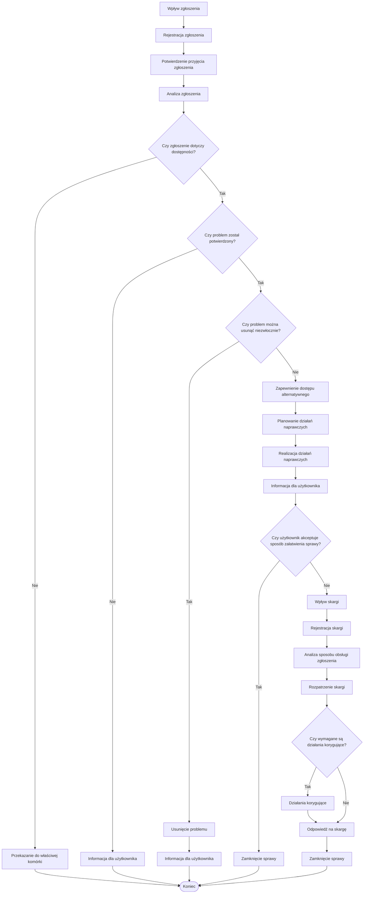
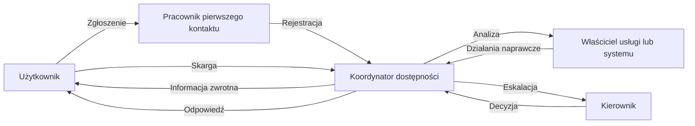

---
id: schemat-procesu-obslugi-zgloszen-i-skarg
title: Schemat procesu obsługi zgłoszeń problemów dostępności cyfrowej i skarg
description: Formularz służący do dokumentowania przebiegu obsługi zgłoszeń problemów dostępności cyfrowej, wniosków o dostęp alternatywny oraz żądań zapewnienia dostępności.
sidebar_label: Schemat procesu obsługi
sidebar_position: 2
keywords: [zgłoszenia problemów,dostęp alternatywny,żądanie zapewnienia dostępności,obsługa zgłoszeń,alert dostępności]
tags: [zgłoszenia problemów,dostęp alternatywny,żądanie zapewnienia dostępności,obsługa zgłoszeń,alert dostępności]
opracowanie: Anna Czekalska, Stefan Wajda
data_zgloszenia: 22 czerwca 2026 r.
ostatnia_aktualizacja: 22 czerwca 2026 r.
wersja_robocza: true
---

## Cel

Schemat przedstawia podstawowy przebieg procesu obsługi zgłoszeń problemów dostępności cyfrowej, żądań zapewnienia dostępności, wniosków o dostęp alternatywny oraz skarg związanych z dostępnością.

---

## Schemat procesu obsługi zgłoszeń problemów dostępności cyfrowej i skarg

## Diagram odpowiedzialności

---

## Uproszczony opis procesu

#### 1. Zgłoszenie

Użytkownik zgłasza problem związany z dostępnością cyfrową, żąda zapewnienia dostępności lub zwraca się o dostęp alternatywny.

### 2. Analiza

Organizacja ustala:

- czego dotyczy problem,
- czy problem rzeczywiście występuje,
- jakie działania są konieczne.

### 3. Reakcja

Jeżeli problem zostanie potwierdzony, organizacja:

- usuwa problem lub
- zapewnia dostęp alternatywny oraz planuje działania naprawcze.

### 4. Informacja dla użytkownika

Użytkownik otrzymuje informację o:

- wyniku analizy,
- podjętych działaniach,
- terminach realizacji,
- możliwościach dalszego postępowania.

### 5. Skarga

Jeżeli użytkownik uzna sposób załatwienia sprawy za niewłaściwy lub organizacja nie podejmie wymaganych działań, może wnieść skargę.

### 6. Doskonalenie

Wnioski wynikające ze zgłoszeń i skarg są wykorzystywane do:

- usuwania problemów systemowych,
- doskonalenia usług cyfrowych,
- aktualizacji procedur,
- poprawy jakości wsparcia użytkowników.
